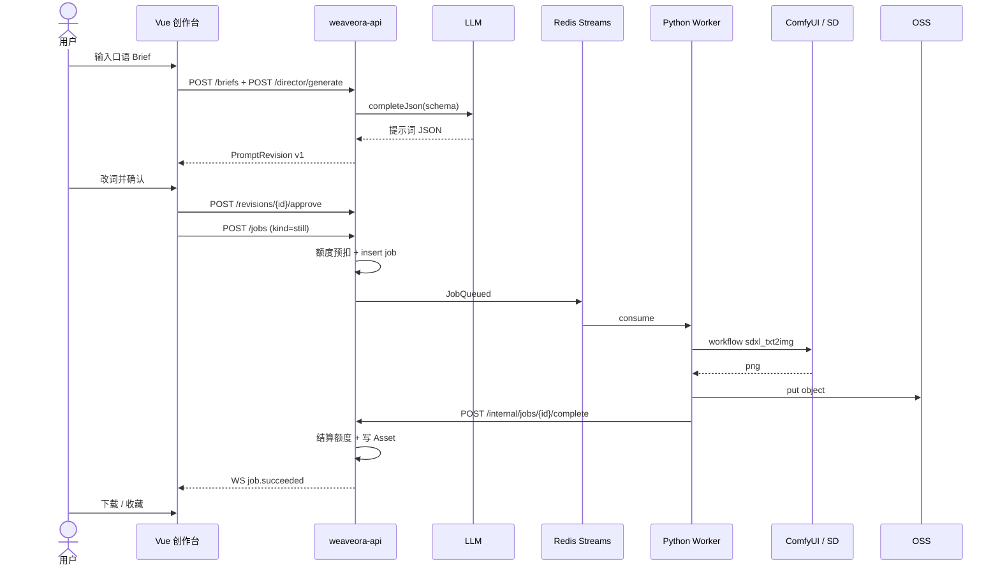
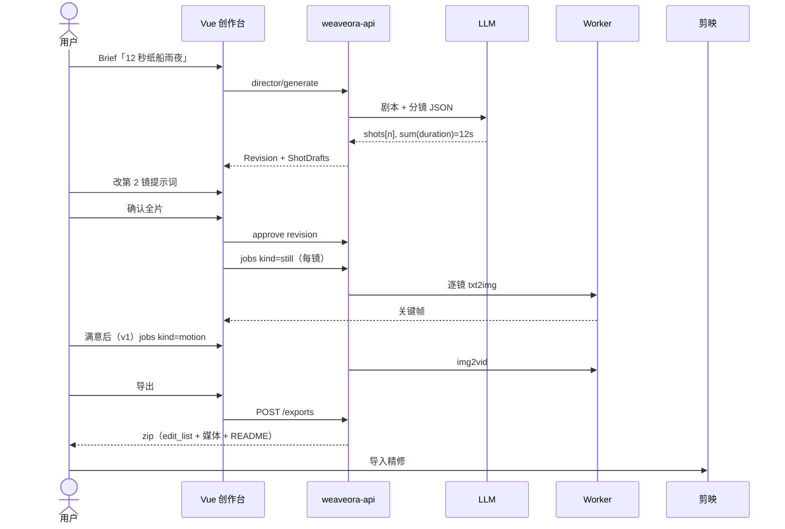
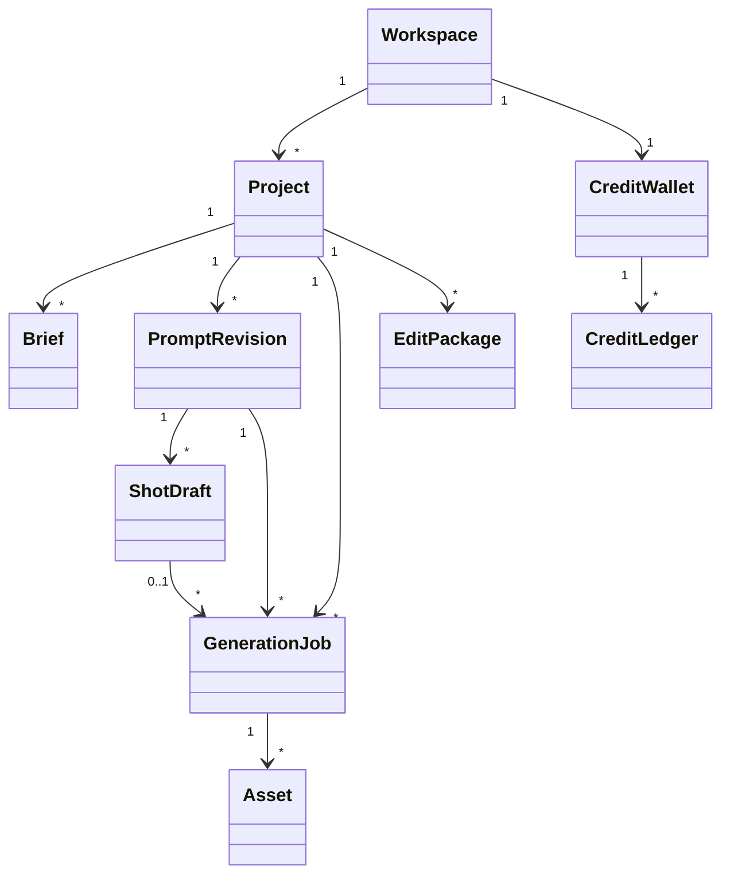
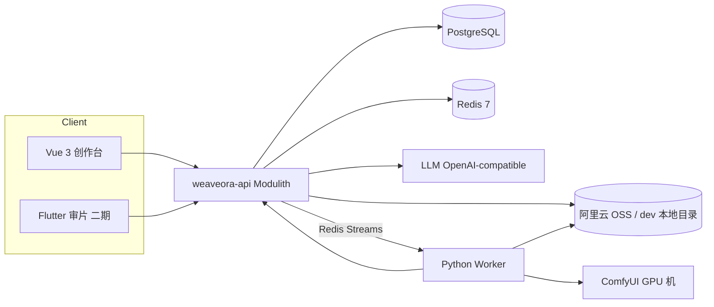
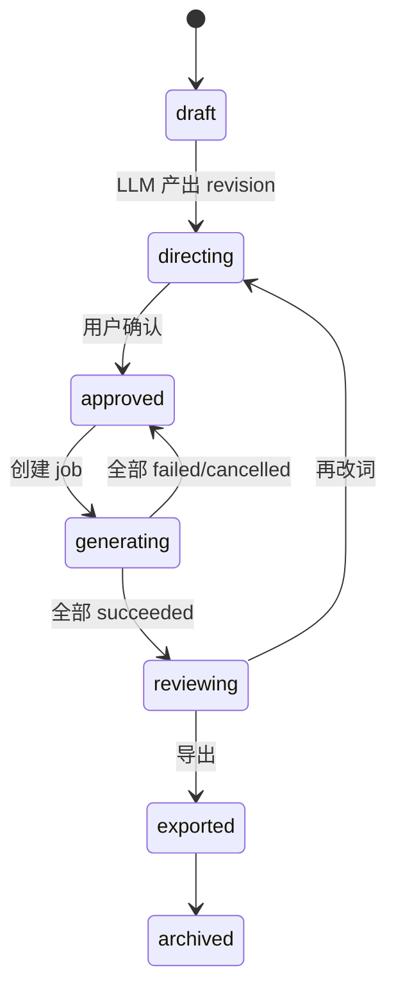

# Weaveora 织影

**产品与技术设计规格书 · v2.0**  
状态：**选型已锁定，v2.0 裁定已确认**（2026-09-04：v1.3–v1.9 各项 + 模型矩阵中立化 / 云 API 后置 / 卖点排序修订）  
日期：2026-09-04  
文档用途：唯一产品 / 架构真源。实现模型先读完全文再写代码，不另发明架构。

> **版本沿革（历史快照，已归档至 §33，不代表当前设计）：** v1.2（首版）→ v1.3（7 项基础裁定：双轨前置/Redis Streams/去 Nacos/Java21+Boot3.4.5/本地存储/简化额度/单人里程碑）→ v1.4（中间件集中 VPS）→ v1.5（开发库本机）→ v1.6（双轨执行 #22）→ v1.7（一致性范围 #23）→ v1.8（定位收窄 #24/#25）→ v1.9（模型时效修正）→ **v2.0（当前）**。各版本细节与当时模型基准见 §33，勿当作现行设计引用。

> **v2.0 变更要点（2026-09-04，你确认建议修订 + 前期分歧点；云 API 在租用 GPU 之后实现服务高阶用户；试用验证矩阵按建议执行）：** ⑰ **模型矩阵中立化（§30 #26）**：不再以 Wan 系为唯一参考——出图 = FLUX.1/FLUX.2 · Nano Banana Pro/2 · Midjourney V8（探索）· Qwen-Image 2.0 · Seedream · SDXL（兼容档）；视频云端 = Runway Gen-4.5（跨镜角色一致最强）· Kling 3.0/Omni · Veo 3.1 · Seedance 2.5 · Wan 3.0（均为 Model Preset 候选，按当期配置）；本地 = **Wan 2.6（成本档）** 等开源。**Sora 2 已关停（2026-03 消费版下线、2026-09-24 API 停服），禁选**。⑱ **卖点排序修订**：剪映导出从主卖点降为**兼容可选项**；新增卖点 = **工作流/一致性/资产复用/可私有化 + 引擎中立（多模型路由，反字节锁定）**（§1/§5/§30 #24 修订）。⑲ **云 API 档后置**：先轨 1 租用 GPU 服务器（本地引擎 Wan2.6 成本档）跑 MVP；**云 API 适配器在 GPU 服务器方案之后实现，服务高阶用户质量档**（§5.1/§11.3/§28 修订）。⑳ **质量门禁降级**：一致性自动门禁（特征向量阈值）为伪精度承诺，**MVP 降为「种子锁 + 主观抽检」**，不承诺自动阈值（§11.4 修订）。详见 §1 / §5 / §11.2 / §11.3 / §11.4 / §30 #24 #26。

---

## 目录

0. 给实现模型的硬性指令（含 0.1 高效使用本文档）  
1. 命名与品牌  
2. 要解决的问题  
3. 目标用户  
4. 产品原则  
5. 版本范围  
6. 核心用户旅程（含时序图）  
7. 功能规格  
8. 信息架构  
9. 关键交互  
10. AI 导演层  
11. Stable Diffusion 与视频生成  
12. 剪映 / CapCut 导出  
13. 领域模型  
14. 数据库设计  
15. 技术选型（**已锁定**，含 MirrorTalk 实测对齐）  
16. 系统架构与模块  
17. API 契约  
18. 前端设计  
19. GPU Worker  
20. 状态机  
21. 存储与媒体  
22. 安全、配额、审计  
23. 配置与部署  
24. 可观测性  
25. 仓库与目录  
26. 编码规范  
27. 测试  
28. 实施里程碑  
29. 风险  
30. **已锁定决策**  
31. 演示与验收  
32. 附录  
33. 版本沿革（历史快照，不代表当前设计）  

---

## 0. 给实现模型的硬性指令

1. **先读完全文，再写代码。** 不要只实现某一章。
2. **不要把 GPU 推理写进 Java。** Stable Diffusion / 视频生成必须跑在 Python Worker 上，Java 只做编排、鉴权、账单、资产与导出。
3. **所有生成必须经过「用户确认」闸门。** 禁止自动把 LLM 草稿直接送进 SD。确认动作要落库（谁、何时、哪一版 prompt）。
4. **图片流与视频流共用 Brief → PromptDraft → Confirm → Job → Asset，视频流额外插入 Script / Scene / Shot / EditPackage。**
5. **MVP 用 Spring Modulith 模块化单体。** 接口按微服务切面设计，等流量或团队规模需要时再按第 16.4 章拆服务。禁止第一天就上 8 个可独立部署的微服务。
6. **前端创作台以 Vue 3 Web 为唯一 MVP 交付面。** Flutter 只做二期移动审片，不要用 Flutter 做第一版故事板 / 提示词工作台。
7. **数据库只有 PostgreSQL（业务）+ Redis（缓存 / 锁 / 限流 / 验证码 / GPU Job 队列）+ 对象存储（媒体）。** 不要用 Mongo 存主数据，**MVP 不再引入 RabbitMQ**（v1.3 裁定，Job 队列用 Redis Streams）。
8. **所有异步 Job 必须可重试、可取消、可幂等。** 以 `idempotency_key` 为幂等键。
9. **密钥不进仓库、不进前端。** LLM / SD / OSS / 剪映凭据只存在环境变量 / 未提交的 profile 配置 / K8s Secret（MVP 无 Nacos，拆分服务后才引入）。
10. **本文第 30 章已锁定。** 若与代码冲突，停下来问产品，不要擅自改产品语义。
11. **UI 文案默认中文，提示词默认英文，API 字段英文。**
12. **本仓库若存在演示用前端，不得当成生产实现。** 生产后端是 Java 21 + Spring Boot 3.4.5（MVP 不依赖 Spring Cloud / Nacos / Gateway），生产前端是 `weaveora-web`（Vue 3）。
13. **禁止 `spring.jpa.hibernate.ddl-auto=update`。** 实体与 Flyway 双写，开发 / 生产均为 `validate`。不要学 MirrorTalk 的自动建表。
14. **禁止 `ConcurrentHashMap` 存验证码 / 登录失败计数 / IP 限流。** 一律 Redis。MirrorTalk 源码自己也写了「生产环境建议用 Redis」。
15. **禁止把 MirrorTalk 的 User 表、同库、配额字段直接拷进织影。** 只参考 JWT 无状态方案；用户 / 工作区 / 额度按本文重建。
16. **禁止用同步 HTTP 堵住 API 线程等 GPU 出图。** LLM 导演方案可以同步等 ≤60s；GenerationJob 必须进 **Redis Streams 工作队列**（消费组 + 独立死信流，v1.3 裁定替代 RabbitMQ）。
17. **ORM 锁定 Spring Data JPA。** 禁止再引入 MyBatis / MyBatis-Plus。
18. **文档正文不锁模型/引擎的具体版本；一切模型版本走 Model Preset / 配置项（§7.8/§23），由配置决定当前最优，正文只写能力档位。**（v1.9，应对模型与软件快速迭代：2026-09 已出现 DeepSeek V4、FLUX.1-Krea、Wan 2.5/2.6/2.7 等换代，锁死版本会让文档迅速过时。）

### 0.1 如何高效使用本文档（实现模型必读，v2.0）

本文档约 1900 行 / ~2 万 tokens。结构策略如下，避免上下文浪费与漏读风险：

1. **每个实现会话开始时完整读入一次本文档全文**（§0–§32；§33 为历史快照可跳过）。约 2 万 tokens 对现代模型上下文（≥128K）无压力，比“分片猜读”更安全。
2. **读完后按 §28 里程碑逐 PR 工作**；每个 PR 只回看与本任务相关的章节（如做 job 只回看 §17/§20/§19），**不要把整份文档反复贴回上下文**。
3. **§0（本条）与 §30 决策表是“约束总纲”**：与正文冲突时，§0/§30 优先；若与代码冲突，停下问产品（§0-10），不要擅改产品语义。
4. **§33 版本沿革 / §1.2 备选名 / §32 附录为可跳过区**：前两者是历史存档，附录仅在用到负面词种子/示例 Brief 时查。
5. **模型/引擎一律读 Model Preset 配置（§23）而非本文**：本文只写能力档位；具体版本看 Nacos/env 中 `weaveora.llm.model`、Model Preset 表，不要根据本文历史章节推断版本。
6. **需要外部事实（模型/价格/竞争）时检索最新信息，不要依赖本文或本模型的记忆**——AI 领域按周迭代，本文已明确不锁版本（§0-18）。

---

## 1. 命名与品牌

### 1.1 选定名称（已锁定）

| 项 | 值 |
| --- | --- |
| 中文名 | 织影 |
| 英文名 | Weaveora |
| 读音 | wee-VOH-rah |
| 域名建议 | weaveora.studio / weaveora.cn |
| 包名 | `studio.weaveora.*` |
| Maven groupId | `studio.weaveora` |
| 仓库 | `weaveora` monorepo，或 `weaveora-platform` / `weaveora-web` / `weaveora-worker` / `weaveora-app` |

**命名理由**

- **织**：把一句话、风格、镜头、音效织成一条可执行的制作线，而不是一次「碰运气出图」。
- **影**：同时覆盖静帧（影像）与短片（影）。
- **ora**：光晕 / aurora 的词根，对应生成后的画面。
- 与「对话类」产品（如 MirrorTalk）形成系列感：Talk 是对话，Weave 是编织成片。

**一句话定位**

> Weaveora 织影是面向创作者与电商/品牌的 **AI 生产工作台**：用户只给粗需求，系统产出可编辑的提示词 / 剧本 / 分镜，**经人工确认后**交给「文生图 → 图生视频」多引擎管线（本地 ComfyUI / 云端视频 API 均可，引擎中立）产出素材，交付成片或兼容导出。**主卖点 = 批量一致素材工作流 + 资产/风格复用 + 可私有化 + 引擎中立（不锁死单一模型/平台）。**

**双轨入口（降低使用门槛，非算力转售；2026-09-04 澄清）**

- **无 GPU 用户**：Weaveora 代接入**预装好 SD 等服务的 GPU 服务器**（RTX 4090 云租市场价约 ¥1.5–2.5/时，可溢价含服务费），开箱即用；时租摊薄后单位产出成本低于按条计费云商（本地 Wan2.6 单条约 ¥0.1–0.4 @¥2.5/时 vs 云 API ¥0.3–1.2/s，本地便宜约 8–24×）。
- **已有 GPU 用户**：连自己的机器，省自建/调环境成本、省人力、提质。
- **主盈利 = 软件/工作流层**（导演层 + 一致性 + 资产库 + 交付）；算力差价可作为盈利点但非主盈利；**算力对用户按成本价透明透传为主**。
- **引擎中立（v2.0）**：出图与视频引擎为可插拔 Model Preset（本地开源 / 国内外云 API），产品不绑死单一模型或单一平台（反锁定：用户不愿把风格资产锁进即梦/剪映单一生态）。

**副标题**

- 中文：把一句话，织成画面与短片
- 英文：From a sentence to a shot.

### 1.2 备选名（已不采用；若品牌层改名，架构不变）

| 名称 | 调性 | 不选原因 |
| --- | --- | --- |
| CineLoom 影织 | 更「电影工业」 | 拼写易被读成 cine-loom 工具名，品牌延展弱 |
| DirectorLoom 导影 | 强调导演 | 「导」字在中文互联网易与导航 / 导购撞车 |
| LuminaForge 光铸 | 更「引擎」 | Forge 在开发者圈过载 |
| SceneSmith 场景匠 | 更「手作」 | 国际名一般，中文名一般 |
| Frameweaver 织帧 | 直白 | 中文名略硬，英文过长 |

### 1.3 品牌视觉（实现必须遵守）

- 放映厅暗色：近黑暖底 `#0B0B0A`，骨白字 `#F3F0E8`，低饱和青绿强调 `#8FB9B4`。
- 次级文字 `#A39E93`，分割线 `#24221F`，危险 `#C45C4A`，成功 `#7AA87A`。
- **禁止** 紫 / 品红 / 霓虹赛博、大面积渐变、emoji 图标、金黄主色、默认 Element Plus 蓝。
- 字体：标题衬线（Fraunces / 思源宋体 Noto Serif SC），正文无衬线（Figtree / 思源黑体 Noto Sans SC），等宽 IBM Plex Mono。
- 标志：片门圆角矩形 + 一条织线穿过。单色，16px 仍可识别。
- 圆角：控件 8px，卡片 12px，弹层 16px。
- 动效：150–200ms ease，禁止弹跳和彩带动画。

---

## 2. 要解决的问题

今天用 SD / ComfyUI / 可灵 / 即梦的真实痛点不是「没有模型」，而是：

1. **用户不会写提示词。** 一句话需求变成可用的 SD 正 / 负向提示、镜头、光、构图，中间缺一层「导演」。
2. **视频比图片更缺结构。** 没有剧本、场次、镜头时长、运镜、角色一致性，模型只会出互不相关的片段。
3. **人机没有闸门。** 一次生成烧掉 GPU 与额度，回改成本高。
4. **生成与精修断裂。** 出了片段还要手动对齐时间线、字幕、BGM，才能进剪映。
5. **工程上 Java 业务中台与 Python GPU 世界分裂。** 需要一条可审计的生产管线，而不是笔记本里的 workflow.json。

Weaveora 不做「又一个模型广场」，做 **导演层 + 确认闸门 + 生成编排 + 精修导出**。

---

## 3. 目标用户（v1.6 按双轨拆分）

| 角色 | 轨 | 诉求 | 成功标准 |
| --- | --- | --- | --- |
| 已自建 ComfyUI 的创作者 / 工作室 | **轨 2（本地 GPU）** | 导演层 / 工作流管理 / 风格资产库叠在自有 GPU 上 | 本地机接自己的 Job，不额外付算力费 |
| 电商视觉 / 独立设计师（无 GPU） | **轨 1（云 GPU）** | 固定风格反复出图，不想管硬件 | 风格模板可复用，种子 / LoRA / 参数可锁定 |
| 广告 / 品牌小团队 | 轨 1 / 轨 2 | 先分镜再拍或先分镜再生成 | 分镜表可评审、可导出 |
| 短视频创作者 / 中小 MCN | 轨 1 | 用口语需求快速出可用素材 | 30 分钟内从一句话到可进剪映的草稿时间线 |

**非目标（MVP 不做）**

- 实时直播连麦数字人
- 长视频（>60s）自动成片
- 替代剪映的完整 NLE
- 训练用户私有大模型（可挂 LoRA，但不提供训练平台）
- 社区 / 广场 / 作品公开 Feed

---

## 4. 产品原则

1. **人是导演，模型是摄影组。** AI 给方案，人点确认。
2. **先结构，后像素。** 视频必须先有剧本和镜头表，再生成。
3. **每一次生成都贵，所以默认可编辑、可 diff、可回滚。**
4. **风格是资产。** 提示词、LoRA、负面词、种子、镜头语言沉淀为可复用模板。
5. **导出是一等公民。** 生成完若不能进剪映，任务不算完成。
6. **可解释。** 用户能看到「为什么会写成这条 prompt」（镜头、风格、禁则拆开显示）。

---

## 5. 版本范围

### 5.1 MVP（v0.9，8–10 周，可演示全链路；v1.7 范围重排）

**执行模型（v1.6 裁定 #22）：双轨。轨 1 = 云 GPU（用户用系统 + 租用我或指定供应商的 GPU）；轨 2 = 用户自带本地 GPU（RTX 3090/4070/4080/4090，连自己工作区）。MVP 以轨 1 先行（Q3-B），轨 2 协议同构（Q2-A：worker 一律出站连 API，不直连 Redis）。**

**核心价值线（v1.8 定位 + v2.0 卖点修订：主卖点 = 批量一致工作流/资产复用/引擎中立，剪映导出为兼容可选项）**

- 图片链路：口语 Brief → LLM 提示词 → 人工确认 → **一致性出图（参考图/IP-Adapter 锚定，产品/物体 + 虚构人物，种子锁 + 主观抽检）** → 选图 / 再生成
- 视频链路：口语 Brief → LLM 剧本 + 分镜 + 逐镜提示词 → 人工确认 → 逐镜关键帧（一致性）→ **本地 Wan2.6 i2v（motion，成本档；云 API 后置高阶档）** → 时间线 → 成片（兼容导出剪映）。**长视频 = 分段 + 衔接 + 剪辑**：产品按目标时长自动拆镜（每镜 ≤ 当前引擎单次上限），尾帧衔接保持连贯（v1.8/v2.0）
- 邮箱登录（手机号验证码可选），项目、草稿
- 风格模板 8 个内置 + 风格/主体资产复用（种子 / LoRA / 参数可锁）
- 额度（simplified 优先）、任务队列、失败重试
- Web 创作台（Vue 3）
- 管理端最小集：模型开关、队列、用户冻结
- **轨 2 最小集（v1.6）**：node 注册/心跳/能力上报（本地机），出站 HTTPS 拉 Job + OSS 直传（Q2-A）；参考环境 Windows + RTX 3090/4070/4080/4090（Q6），必要时陪用户装 ComfyUI/驱动

### 5.2 v1.0

- **可识别真人人像一致性**（肖像授权 + AI 标识 + 深度合成合规后解锁；框架在 MVP 已留位：主体分档字段 + 授权元数据列）
- 更完整的角色 / 场景一致性（IP-Adapter 多参考 / 参考视频）
- 镜头级视频增强（Wan 高配档成熟化 / 云端视频 API 适配器：可灵、即梦、Veo、Wan 云 API）
- 旁白 TTS、字幕轨、BGM 推荐
- 团队空间、评论、审片
- 剪映草稿更完整（转场、关键帧、字幕样式）
- 管理后台：模型、队列、成本看板

### 5.3 v1.5+

- Flutter 移动端审片 / 出图确认
- 自动粗剪（根据剧本切镜头、配字幕）
- 工作流市场（ComfyUI workflow 上架）
- 多模型路由（SDXL / Flux / 可灵 / 即梦 / Runway 适配器）
- 品牌套装（Logo、字体、色板注入提示词）
- 微信登录

---

## 6. 核心用户旅程

### 6.1 图片

```
登录 → 新建项目 → 选择「图片」
  → 输入口语需求（可上传参考图）
  → 选择风格模板 / 比例 / 张数
  → AI 导演产出：正向提示、负向提示、参数建议、中文解释
  → 用户改词 / 锁镜头 / 锁风格 → 确认
  → 创建 GenerationJob → GPU Worker 调 SD
  → 多图候选 → 用户挑图 / 局部重绘 / 放大
  → 入库 Asset → 下载或送入视频项目当关键帧
```



### 6.2 短视频

```
登录 → 新建项目 → 选择「短视频」
  → 输入口语需求 + 时长（6 / 10 / 15 / 30s）+ 画幅（9:16 / 16:9 / 1:1）
  → AI 导演产出：
       一句话 logline
       剧本（起承转合，按秒）
       场次与镜头表（景别、运镜、动作、对白、音效）
       每镜 SD / 视频提示词 + 负面词 + 一致性约束
       剪映时间线草案（轨、入出点、转场）
  → 分镜墙：用户改某一镜，可只重生成该镜
  → 确认全片或确认单镜
  → Worker 按镜生成（静帧预可视化 → 可选视频片段）
  → 时间线预览（Web 粗剪）
  → 导出 Jianying Edit Package
  → 用户在剪映精修
  → 回传成片（可选）→ 项目完成
```



闸门：**LLM 输出 ≠ 已确认。** 状态机见第 20 章。

---

## 7. 功能规格

### 7.1 账号与工作区

- 注册 / 登录：邮箱 + 密码为 MVP 必做；手机号 + 验证码可同期；微信为 v1.5。
- 工作区（Workspace）：个人默认一间；v1 支持成员与角色（Owner / Editor / Reviewer / Viewer）。
- 额度：按「LLM token / 出图张数 / 视频秒数 / 存储 GB」计量，记在 **CreditWallet**，不要做 MirrorTalk 那种挂在 User 上的三级配额字段。
- 项目：名称、模式（image | video | mixed）、画幅、风格、状态。

### 7.2 Brief（粗需求）

| 字段 | 约束 |
| --- | --- |
| `raw_text` | 必填，10–2000 字 |
| `mode` | `image` \| `video` \| `auto`（LLM 分类，用户可改） |
| `duration_sec` | 仅视频：6 / 10 / 15 / 30 |
| `aspect_ratio` | `1:1` `3:2` `2:3` `16:9` `9:16` |
| `style_template_id` | 可选 |
| `reference_asset_ids[]` | 参考图，最多 4 |
| `constraints` | 必须出现 / 禁止出现 / 品牌色 / 语言 |
| `count` | 图片张数 1 / 2 / 4，默认 2 |

### 7.3 AI 导演（Prompt Studio）

对图片输出：

| 字段 | 说明 |
| --- | --- |
| title | 短标题 |
| logline | 一句话画面 |
| positive_prompt | 英文为主、可含质量词，面向 SD |
| negative_prompt | 标准负面 + 用户禁则 |
| prompt_zh | 中文解释，给不懂 SD 的人看 |
| camera | 焦距、机位、景别 |
| lighting | 光型 |
| palette | 3–5 色 |
| params | sampler, steps, cfg, width, height, seed 建议 |
| variations | 2–3 个风格变体，用户可切换 |

对视频额外输出：

- `script.acts[]`：段、时长、目的
- `scenes[]` / `shots[]`：见领域模型
- `audio`：BGM 情绪、SFX、VO 文案
- `edit_plan`：轨结构、转场、字幕

### 7.4 确认与版本

- 每次 LLM 产出是一个 `PromptRevision`（diff 可看）。
- 用户编辑后另存为新 revision，不覆盖。
- 「确认生成」把某 revision 钉成 `approved_revision_id`。
- 允许「只确认第 3 镜」。
- 未确认时，前端主按钮禁用，API 返回 `REVISION_NOT_APPROVED`。

### 7.5 生成

- 图片：1 / 2 / 4 张；支持同种子对比 sampler。
- 视频：先出每镜关键帧（便宜），用户满意后再出运动片段（贵）。
- 默认策略：**预可视化（still）→ 确认 → 运动（clip）**。
- 失败：把 ComfyUI / SD 错误转成可读原因（OOM、NSFW、超时、模型未加载）。

### 7.6 资产

- 原图、缩略图、视频 mp4、预览 webp、prompt 快照、seed、模型哈希一并保存。
- 可收藏、可打分、可设为参考图。

### 7.7 导出剪映

导出 zip，内含：

```
{project_name}_weaveora_edit/
  README.md
  edit_list.json
  jianying/
    draft_content.json
    draft_meta_info.json
    assets/
  captions.srt
  voiceover.txt
  prompts.md
```

**不允许**假装能一键控制用户本机剪映。MVP 是「导出草稿包 + 导入说明」。

### 7.8 模板与模型

- Style Template：提示词前缀 / 后缀、负面、推荐 sampler、LoRA 列表。
- Model Preset：能力档位（出图：SDXL 兼容 / FLUX 系 / 云端图 API；视频：本地 Wan / 云端视频 API 等），指向 Worker 里的 ComfyUI workflow 或云 API 适配器；**具体模型版本为配置项，不写死在文档**（v1.9）；**候选清单跨国内外多引擎，实现期在 Model Preset 内维护当前最优**（v2.0，见 §11.2 矩阵）。
- 管理员可热更新，不发版。

### 7.9 MVP 内置风格模板

| slug | 名称 | 用途 |
| --- | --- | --- |
| `cinematic-still` | 电影静帧 | 低饱和、变形宽银幕感、实用光 |
| `product-ad` | 产品广告 | 干净背景、柔和棚灯、材质清晰 |
| `ink-wash` | 水墨 | 宣纸、焦墨、留白 |
| `jp-anime` | 日漫 | 赛璐璐、清晰线、二次元光 |
| `documentary` | 纪录片 | 自然光、手持感、真实纹理 |
| `cyber-night` | 赛博夜景 | 湿路面、青橙对比、霓虹克制使用 |
| `soft-still-life` | 柔光静物 | 窗光、浅景深、静物，不出人脸 |
| `architecture` | 建筑空间 | 超广角、体积光、材质真实 |

默认 **关闭「真人模特」类模板**。用户 Brief 明确要求人物时，导演层用非可识别面孔（远景、背影、剪影）。

---

## 8. 信息架构（Web）

```
/login
/app                          项目列表
/app/projects/new             新建（选图片或视频）
/app/projects/:id             项目总览
/app/projects/:id/brief       粗需求
/app/projects/:id/director    提示词 / 剧本工作室（核心）
/app/projects/:id/board       分镜墙
/app/projects/:id/generate    任务与进度
/app/projects/:id/gallery     资产
/app/projects/:id/timeline    粗剪时间线（视频）
/app/projects/:id/export      导出
/app/styles                   风格模板
/app/settings                 账号、额度
/admin                        模型、队列、用户、成本
```

移动端（Flutter 二期）只做：项目列表、确认生成、画廊、通知。

---

## 9. 关键交互细节

### 9.1 导演台（必须做成左右栏）

- 左：Brief 原文 + 约束，始终可见。
- 中：结构化方案（剧本、镜头、提示词），可逐段内联编辑。
- 右：参数、风格、参考图、费用预估。
- 底：版本时间条（v1、v2、v3…）和「确认并生成」主按钮。
- 费用预估在按钮旁：**约 N 张图 / M 秒视频 / x 积分**，点下去才扣。

### 9.2 分镜墙

- 每张卡片：镜号、时长、缩略图、状态（草稿 / 已确认 / 生成中 / 完成 / 失败）。
- 拖拽改顺序，自动重算时间码。
- 单卡「重写提示词」「只生成这一镜」。

### 9.3 生成中

- WebSocket 推进度（queued / loading_model / sampling 37% / uploading / done）。
- 允许取消；取消必须真正 kill worker 任务，不能只改 UI。

### 9.4 空状态

- 新项目：三张示例 Brief（「一只纸船穿越城市雨夜的 12 秒短片」「青瓷器物静物海报」「被水淹的巴洛克图书馆」）。
- 点示例即填入，降低白屏恐惧。

### 9.5 权限与按钮态

| 条件 | 确认并生成 | 导出 |
| --- | --- | --- |
| 无 revision | 禁用 | 禁用 |
| 有 revision 未 approve | 禁用（提示先确认） | 禁用 |
| 已 approve 无 asset | 可点 | 禁用 |
| 有 still assets | 可再生成 | 视频项目可导出静帧时间线 |
| 额度不足 | 禁用并说明 | — |

---

## 10. AI 导演层

### 10.1 模型分工

| 任务 | 推荐（v1.9：按当期配置，不锁版本） | 备注 |
| --- | --- | --- |
| Brief 分类、补全、中文剧本 | **DeepSeek V4 系（pro / flash）** 默认；通义 / GLM 等备选 | JSON schema 强制；具体模型走 §23 配置，不写死 |
| 英文化 SD 提示词 | 同一 LLM，用专用 system prompt | 不要用翻译腔 |
| 分镜时长分配 | LLM + 规则校验器 | 时长总和必须 == 用户指定，误差 ≤ 0.5s |
| NSFW / 品牌安全 | 规则 + 分类模型 | 拦截在确认前 |
| 多模态理解参考图 | 带视觉的 LLM | 把参考图特征写入约束 |

统一抽象：`LlmClient.completeJson(JsonSchema schema, List<Message> messages)`。  
全部走 **OpenAI Compatible** `baseUrl + apiKey + model`。模型名放配置中心或配置项，不写死（MVP 用 Spring profile / 环境变量）。

**与 MirrorTalk 的差异：** MirrorTalk 用 `WebClient` 同步 block 等 AI 结果。织影的 **director/generate 允许同步等 ≤60s**（用户在等方案）；**禁止**用同样方式等 GPU。

### 10.2 输出必须是 JSON，禁止散文

图片 schema（字段名稳定，作为 API 契约）：

```json
{
  "mode": "image",
  "title": "Flooded Library",
  "logline": "Moonlight over a drowned baroque library.",
  "prompt_zh": "月光从穹顶砸进被水淹没的巴洛克图书馆，无人，只有漂浮的书页。",
  "positive_prompt": "flooded baroque library at night, single moonlight shaft, floating books, still water mirror, cinematic still, 35mm, no people",
  "negative_prompt": "people, text, watermark, logo, subtitle, blurry, lowres",
  "camera": { "focal_mm": 35, "shot_size": "wide", "angle": "low" },
  "lighting": "single moonlight shaft, teal bounce",
  "palette": ["#0B1C22", "#C7B7A3", "#8FB9B4"],
  "params": {
    "width": 1216, "height": 832, "steps": 30, "cfg": 5.5,
    "sampler": "dpmpp_2m_karras", "seed": null
  },
  "variations": []
}
```

视频 schema：

```json
{
  "mode": "video",
  "title": "Paper Boat",
  "logline": "A paper boat crosses a city in rain.",
  "duration_sec": 12,
  "aspect_ratio": "16:9",
  "script": {
    "theme": "孤独与穿行",
    "acts": [
      { "name": "setup", "start_sec": 0, "end_sec": 3, "purpose": "建立水面与纸船" }
    ]
  },
  "shots": [
    {
      "shot_no": 1,
      "duration_sec": 3.0,
      "shot_size": "wide",
      "camera_move": "slow dolly in",
      "action": "paper boat drifts on glassy dusk water",
      "positive_prompt": "paper boat on dark rainy city canal, dusk, cinematic, 35mm",
      "negative_prompt": "people, text, watermark",
      "seed_lock": true,
      "ref_shot_no": null
    }
  ],
  "audio": {
    "music_mood": "sparse piano, wet atmosphere",
    "sfx": ["distant rain", "soft water lap"],
    "vo": ""
  },
  "edit_plan": {
    "fps": 30,
    "transition_default": "cut",
    "subtitle": false
  }
}
```

对应 Java record 放在 `studio.weaveora.director.api` 包，前后端共享同一份 JSON Schema 文件：`packages/schemas/director.schema.json`。

### 10.3 规则校验（代码，不靠模型自觉）

类：`DirectorPlanValidator`（纯函数，单测覆盖）。

- `sum(shot.duration_sec) == duration_sec ± 0.5`
- 每个 shot 必须有 `positive_prompt` 且长度 20–1200
- `negative_prompt` 自动合并模板负面词（去重）
- 禁止 shot 数量 > `ceil(duration_sec / 1.5)`
- 视频默认 4–8 镜 / 12 秒
- 画幅映射到偶数宽高（SD 要求 8 的倍数，推荐 64 的倍数）
- JSON 解析失败则重试 1 次，仍失败则返回可编辑的原文并标 `DIRECTOR_PARSE_FAILED`
- 命中 NSFW 词表 → `BRIEF_BLOCKED`，不落可生成 revision

### 10.4 System prompt 要点

实现时放入 `director/src/main/resources/prompts/`，不写死在代码字符串散落各处。

- 你是电影摄影指导 + 分镜师，不是聊天机器人。
- 面向 Stable Diffusion XL / Flux：主语 + 场景 + 光线 + 镜头 + 风格 + 质量。
- 不要堆 20 个质量词；3 个以内。
- 用户没要求文字，则 negative 必须含 `text, watermark, logo, subtitle`。
- 用户没要求真人，则不要发明可识别人脸。
- 中文 Brief 可以保留专有名词，提示词用英文。
- 输出且只输出 JSON。

文件：

```
prompts/director_image_system.md
prompts/director_video_system.md
prompts/director_rewrite_shot.md
prompts/brief_classify.md
```

---

## 11. Stable Diffusion 与视频生成

### 11.1 原则：ComfyUI 为执行引擎 + 双轨执行模型（v1.6 裁定 #22）

Java 不直接调 diffusers。**执行分为两轨，worker 协议完全同构**（Q2-A：worker 一律出站主动连 API，不反向直连 Redis）：

- **轨 1 · 云 GPU**：用户用系统 + 算力跑在 **我租的 GPU 服务器 或 指定 GPU 供应商的服务器**上（Q3-B：MVP 先行）。worker 由我部署在这些服务器上，归属于我方节点池；按用量计费。
- **轨 2 · 本地 GPU（BYO）**：用户自带 GPU 主机（Windows + RTX 3090/4070/4080/4090，Q6），把 Weaveora worker 装在自己机器上，注册到自己的工作区；只接本工作区 Job，不接他人 Job。

**统一 worker 通道（轨 1 / 轨 2 相同）：**

```
worker 启动 → 向 API 注册（node_id, workspace 归属, 能力上报: GPU型号/显存/已装workflow/ComfyUI版本）
       → 出站 HTTPS 长轮询/WebSocket 拉 Job（POST /internal/nodes/{id}/claim）
       → 执行 ComfyUI → 上传 OSS（直传）→ 回调 API 终态
心跳：worker 每 30s 向 API 报在线（Redis 记 worker:{id} TTL，仅作内部状态）
```

Job 派发：API 按 **Job.workspace_id → 该工作区可用节点** 派发；我方云节点池可服务多个工作区，轨 2 节点只服务自己工作区。Job 状态含 `waiting_node`（无节点在线时）。

能力协商（必做）：worker 上报已装 workflow 与模型清单；导演层 / 下单时校验 `workflow_id` 是否该节点可用（如用户未装 Flux 则降 SDXL 或提示安装），模型 `model_hash` 运行前校验，结果与声明不符则报错不结算。

（内部参考：早期 v1.3 的 “Worker 暴露 POST /worker/v1/jobs + Redis Streams 消费” 仅作为我方节点池 / 运维内部通道，不作为对用户节点的外部协议；对用户节点统一走上述出站通道。）

### 11.2 内置 workflow（Worker 仓库；v1.9：只定义能力档位，具体模型版本走 Model Preset 配置）

| ID（档位） | 用途 | MVP |
| --- | --- | --- |
| `txt2img`（SDXL / FLUX / 云 API） | **兼容档**（SDXL，低显存/生态兜底）+ **质量档**（FLUX.1 系 / Krea Dev FP8 12G / GGUF 分级） | 必做（质量档轨 1 默认，v2.0） |
| `txt2img_cloud` | 云图 API（Nano Banana / GPT Image / Midjourney 等按当期配置） | v1.5 候选 |
| `img2img` / `inpaint` | 参考图 / 重绘 / 局部修 | 必做 |
| `ipadapter_ref` | **物体 / 虚构人物一致性**（产品、场景、IP 角色，非真实自然人） | **必做（v1.7 提前）** |
| `upscale_2x` / `upscale_4x` | 放大 / 高清化 | **2x 必做（质量基线），4x 可选** |
| `wan_i2v`（档位 5B / 14B） | **本地成本档**关键帧 → 运动（**本地主流 = Wan 2.6**：1080p 电影级、角色一致、原生音频、单次 ~15s；14B-FP8≈16G / FP16≈24G 需 4090） | **必做（替代 SVD）** |
| `cloud_video_api` | **高阶质量档**（Runway Gen-4.5 · Kling 3.0/Omni · Veo 3.1 · Seedance 2.5 · Wan 3.0 等，按当期最优配置） | **租用 GPU 方案之后实现，服务高阶用户（v2.0 后置）** |
| `svd_img2vid` | ~~关键帧 → 短运动~~ | **废弃（v1.7；非商用许可 + 质量落后）** |
| `stub_txt2img` | 开发占位图 | 必做 |

**2026-09 引擎中立候选矩阵（v2.0；Model Preset 在实现期按当期实测/授权/成本选择最优，本文档不锁单一家）：**

| 环节 | 候选（2026-09） | 类型 | 定位 |
| --- | --- | --- | --- |
| 出图 | FLUX.1 系 / FLUX.2 Pro·Max | 开源/云 | 批量、品牌一致、电影级渲染、成本低 → **质量档默认** |
| 出图 | Nano Banana Pro/2 · GPT Image 2 · Midjourney V8（探索） | 国外云 | 可交付生产级 / 灵感探索 |
| 出图 | Qwen-Image 2.0 · Seedream | 国内 | 中文/文本渲染 |
| 出图 | SDXL | 开源 | 生态兼容兑底（LoRA 最全），质量非最优 |
| 视频云 | Runway Gen-4.5 | 国外云 | **跨镜头角色一致性最强**、镜头控制（若做真人生成优先评估） |
| 视频云 | Kling 3.0/Omni · Seedance 2.5 · Veo 3.1 · Wan 3.0 | 国内/国外云 | 质量/即时/30s 上限（Wan3.0 ¥0.3-1.2/s 官方现行价） |
| 视频本地 | Wan 2.6（LTX-2.3 等备选） | 开源 | **成本档**：便宜 8-24× + 私有 + 可控，质量落后云约半代 |
| ⚠️ Sora 2 | **已关停**（2026-03 消费版下线，2026-09-24 API 停服） | — | **禁选** |

模型文件 **不进 git**；各候选商用授权（FLUX 系 / LTX / Hunyuan / 各云 API）启用前逐项书面核实（v1.9/v2.0）。

### 11.3 视频两段式（强制，已锁定）+ 质量口径（v1.8）

1. **Still pass**：每镜 1 张关键帧（带一致性锚定），便宜、利于改词。
2. **Motion pass**：用户确认关键帧后 img2vid / txt2vid。

禁止 MVP 一上来就对未确认剧本烧视频秒数。

**视频质量目标（v1.8，1:A）：电影感 = 长期定位；MVP 验收用可量化口径。**

- **可量化 MVP 验收**：目标时长 15s 内成片（2–4 镜拼接，本地 Wan2.6 单镜可达 ~8-10s），单镜 ≤10s，主体跨镜一致，分辨率 720–1080p，达到「可商用、观感中高质」基线；电影感主观样片对比仅作内部定标，不作 MVP 硬门槛。
- **物理上限（v1.9/v2.0 修订）**：所有视频模型**单次生成均有硬上限且随版本放宽**——本地 Wan 2.6 单次 ~15s（参考生视频 ~10s）；云端 Veo3.1 单次 4/6/8s、Kling 3.0 / Seedance 2.5 / Wan 3.0 可达 ~15–30s。**实现时从 Model Preset 读取当前单次上限**，据此拆镜。
- **长成片 = 分段 + 衔接 + 剪辑（产品封装逻辑）**：按目标时长 + 当前引擎单次上限自动拆镜 → 逐镜生成 → 尾帧衔接法保连贯（上段尾帧作下段参考首帧）→ 多镜时间线拼接/转场/字幕/音乐/调色 → 15–60s 成片（可剪映兼容导出或平台内出片）。
- **本地（轨 1 租用 GPU + Wan2.6）定位 = 成本档单镜素材生成器**（3–10s/镜，单条成本 ¥0.1–0.4 @¥2.5/时，比云 API 便宜约 8–24×，但需 3–9 分钟/条 → 批量队列掩盖等待）；**云端视频 API 为高阶质量档，在租用 GPU 方案之后实现**（v2.0 后置），服务要最新质量/即时/更长单段的用户。
- 用户 UX：选目标时长（15/30/60s）时产品自动按当前引擎能力拆镜并告知单镜上限，不让用户面对「只能生成几秒」的挫败。

### 11.4 安全（v1.7 增补人物分档；v1.9 增质量门禁）

- 提示词过 NSFW 词表 + 可选 CLIP 分类。
- 输出再扫一次。命中则资产标记 `blocked`，不对用户展示原图，记审计。
- 用户重复打安全策略则冻账号。
- **主体分档（v1.7，问题 2）**：
  - **产品 / 物体 / 场景 / 风格**：MVP 放行，常规审核。
  - **虚构人物 / IP / 动漫 / 吉祥物（非真实自然人）**：MVP 放行，常规审核 + IP 版权提示（用户自持或已授权）。
  - **可识别真人**：**v1.0 才解锁**。需：肖像授权声明（用户上传自持素材）、AI 生成内容显式/隐式标识（2025-09 起《AI 生成合成内容标识办法》）、深度合成服务合规（算法备案/内容审核/日志）、未成年人/公职人员/公众人物拦截。
- **质量门禁（v2.0 降级修订）**：MVP **不做自动一致性特征向量阈值门禁**（属伪精度承诺，跨镜自动比对不可靠）——改为 **种子锁 + 主观抽检**：同一参考主体出多张时固定种子并抽查关键张一致性；另加基础质量过滤（黑图/纯色/分辨率过低/损坏文件自动剔除）。自动一致性校验留作 v1.0+ 探索项，不承诺阈值。

### 11.5 画幅 → 像素

| 比例 | 图片默认 | 视频默认 |
| --- | --- | --- |
| 1:1 | 1024×1024 | 1024×1024 |
| 3:2 | 1216×832 | 1920×1280 预览用 768×512 |
| 2:3 | 832×1216 | 768×1152 |
| 16:9 | 1344×768 | 1920×1080（生成可用 1280×720） |
| 9:16 | 768×1344 | 1080×1920（生成可用 720×1280） |

---

## 12. 剪映 / CapCut 导出（v2.0：降为兼容可选项，非主卖点）

> v2.0 定位：字节已将剪映与即梦原生打通（V9.20 一键同步），第三方"导出剪映草稿"不再是差异化主卖点。**剪映导出保留为兼容可选项**（用户已有剪映工作流时用），主卖点 = 批量一致工作流 + 资产复用 + 可私有化 + 引擎中立。若草稿加密导致适配失败，按 README 手工导入降级（既有兜底不变）。

### 12.1 `edit_list.json`（Weaveora 自己的稳定契约）

```json
{
  "version": "1.0",
  "project_id": "…",
  "title": "Paper Boat",
  "fps": 30,
  "width": 1920,
  "height": 1080,
  "duration_sec": 12,
  "tracks": [
    {
      "type": "video",
      "clips": [
        {
          "shot_no": 1,
          "asset_id": "…",
          "src": "assets/shot_01.mp4",
          "in_sec": 0,
          "out_sec": 3,
          "timeline_start_sec": 0
        }
      ]
    },
    { "type": "audio", "clips": [] },
    { "type": "caption", "clips": [] }
  ]
}
```

JSON Schema 文件：`packages/schemas/edit_list.schema.json`。  
剪映 `draft_content.json` 是不稳定私有格式，用 **适配器** 生成，失败时至少保证 `edit_list.json` + 媒体文件 + README 可用。

```java
public interface EditAdapter {
  String vendor(); // "jianying" | "generic"
  void write(Path dir, EditList list, List<ResolvedAsset> assets) throws ExportException;
}
```

### 12.2 README 必须告诉剪辑师

- 画幅与帧率、镜号对应文件名、建议的转场、VO 文案
- 「这些片段由 Weaveora 生成，精修在剪映完成」
- 若 jianying 适配失败：写明「请按 edit_list.json 手工导入」

---

## 13. 领域模型

```
Workspace 1──n Project
Workspace 1──n Membership (v1)
Project 1──n Brief
Brief 1──n PromptRevision
PromptRevision 1──n ShotDraft
Project 1──n GenerationJob
GenerationJob n──1 PromptRevision (or ShotDraft)
GenerationJob 1──n Asset
Project 1──n EditPackage
StyleTemplate / ModelPreset  (全局或工作区)
CreditWallet 1──n CreditLedger
AuditLog
```

| 实体 | 职责 |
| --- | --- |
| **Workspace** | 计费与隔离边界 |
| **Project** | 一次创作任务的容器 |
| **Brief** | 用户口语需求快照 |
| **PromptRevision** | AI 或用户产生的某一版方案 |
| **ShotDraft** | 视频镜头行 |
| **GenerationJob** | 一次 GPU 执行 |
| **Asset** | 一张图或一段视频 |
| **EditPackage** | 一次导出 |
| **CreditWallet** | 工作区余额 |



---

## 14. 数据库设计（PostgreSQL 16）

约定：

- PK 一律 `UUID`，应用侧 **UUIDv7**。
- 时间一律 `timestamptz`，时区 UTC 存储。
- 软删 `deleted_at`。
- JSONB 仅用于确实会变的结构（params、camera、edit_plan），镜头表仍用关系表。
- 所有业务表带 `workspace_id`（除全局字典 `model_presets`、系统 `style_templates`）。
- 迁移工具 **Flyway**，脚本 `V1__init.sql`、`V2__credits.sql`…。JPA 实体与脚本字段必须一致。
- `spring.jpa.hibernate.ddl-auto=validate`（开发与生产相同）。**禁止 `update`。**
- ORM：**Spring Data JPA + Hibernate 6**（对齐 MirrorTalk）。查询以派生方法 + `@Query` JPQL 为主。实体放各模块 `domain` 包，禁止跨模块引用对方实体。
- 开发库：v1.5 起 dev profile **连本机 PG `weaveora_dev`**（上生产前过渡，本机 PG 18.4 已在跑）；需验证生产结构时切 VPS `weaveora_test`。单测用 Testcontainers PG。**不要用 H2**（JSONB / citext / 部分索引与 H2 行为不同）。

```sql
CREATE EXTENSION IF NOT EXISTS "pgcrypto";
CREATE EXTENSION IF NOT EXISTS "citext";
CREATE EXTENSION IF NOT EXISTS "pg_trgm";

CREATE TABLE workspaces (
  id            uuid PRIMARY KEY,
  name          text NOT NULL,
  owner_user_id uuid NOT NULL,
  plan          text NOT NULL DEFAULT 'free',
  created_at    timestamptz NOT NULL DEFAULT now(),
  deleted_at    timestamptz
);

CREATE TABLE users (
  id            uuid PRIMARY KEY,
  email         citext UNIQUE,
  phone         text UNIQUE,
  password_hash text,
  display_name  text NOT NULL,
  status        text NOT NULL DEFAULT 'active',
  created_at    timestamptz NOT NULL DEFAULT now(),
  deleted_at    timestamptz
);

CREATE TABLE memberships (
  workspace_id  uuid NOT NULL REFERENCES workspaces(id),
  user_id       uuid NOT NULL REFERENCES users(id),
  role          text NOT NULL,
  created_at    timestamptz NOT NULL DEFAULT now(),
  PRIMARY KEY (workspace_id, user_id)
);

CREATE TABLE credit_wallets (
  workspace_id  uuid PRIMARY KEY REFERENCES workspaces(id),
  balance       numeric(12,4) NOT NULL DEFAULT 0,
  frozen        numeric(12,4) NOT NULL DEFAULT 0,
  updated_at    timestamptz NOT NULL DEFAULT now(),
  CONSTRAINT chk_wallet_nonneg CHECK (balance >= 0 AND frozen >= 0)
);

CREATE TABLE style_templates (
  id            uuid PRIMARY KEY,
  workspace_id  uuid REFERENCES workspaces(id),
  slug          text NOT NULL,
  name          text NOT NULL,
  prompt_prefix text NOT NULL DEFAULT '',
  prompt_suffix text NOT NULL DEFAULT '',
  negative      text NOT NULL DEFAULT '',
  default_params jsonb NOT NULL DEFAULT '{}',
  is_system     boolean NOT NULL DEFAULT false,
  created_at    timestamptz NOT NULL DEFAULT now()
);

CREATE TABLE model_presets (
  id            uuid PRIMARY KEY,
  slug          text NOT NULL UNIQUE,
  kind          text NOT NULL,
  workflow_id   text NOT NULL,
  display_name  text NOT NULL,
  cost_unit     text NOT NULL,
  cost_credits  numeric(12,4) NOT NULL,
  enabled       boolean NOT NULL DEFAULT true
);

CREATE TABLE projects (
  id                    uuid PRIMARY KEY,
  workspace_id          uuid NOT NULL REFERENCES workspaces(id),
  created_by            uuid NOT NULL REFERENCES users(id),
  title                 text NOT NULL,
  mode                  text NOT NULL,
  aspect_ratio          text NOT NULL,
  duration_sec          numeric(6,2),
  style_template_id     uuid REFERENCES style_templates(id),
  status                text NOT NULL,
  approved_revision_id  uuid,
  created_at            timestamptz NOT NULL DEFAULT now(),
  updated_at            timestamptz NOT NULL DEFAULT now(),
  deleted_at            timestamptz
);

CREATE TABLE briefs (
  id            uuid PRIMARY KEY,
  project_id    uuid NOT NULL REFERENCES projects(id),
  workspace_id  uuid NOT NULL REFERENCES workspaces(id),
  raw_text      text NOT NULL,
  mode          text NOT NULL,
  constraints   jsonb NOT NULL DEFAULT '{}',
  created_at    timestamptz NOT NULL DEFAULT now()
);

CREATE TABLE prompt_revisions (
  id            uuid PRIMARY KEY,
  project_id    uuid NOT NULL REFERENCES projects(id),
  workspace_id  uuid NOT NULL REFERENCES workspaces(id),
  brief_id      uuid NOT NULL REFERENCES briefs(id),
  revision_no   int NOT NULL,
  source        text NOT NULL,
  schema_json   jsonb NOT NULL,
  title         text,
  logline       text,
  positive_prompt text,
  negative_prompt text,
  created_by    uuid REFERENCES users(id),
  created_at    timestamptz NOT NULL DEFAULT now(),
  UNIQUE (project_id, revision_no)
);

CREATE TABLE shot_drafts (
  id            uuid PRIMARY KEY,
  revision_id   uuid NOT NULL REFERENCES prompt_revisions(id) ON DELETE CASCADE,
  shot_no       int NOT NULL,
  duration_sec  numeric(6,2) NOT NULL,
  shot_size     text,
  camera_move   text,
  action        text,
  positive_prompt text NOT NULL,
  negative_prompt text NOT NULL,
  seed_lock     boolean NOT NULL DEFAULT true,
  ref_shot_no   int,
  status        text NOT NULL DEFAULT 'draft',
  UNIQUE (revision_id, shot_no)
);

CREATE TABLE generation_jobs (
  id              uuid PRIMARY KEY,
  project_id      uuid NOT NULL REFERENCES projects(id),
  workspace_id    uuid NOT NULL REFERENCES workspaces(id),
  revision_id     uuid REFERENCES prompt_revisions(id),
  shot_id         uuid REFERENCES shot_drafts(id),
  model_preset_id uuid NOT NULL REFERENCES model_presets(id),
  kind            text NOT NULL,
  state           text NOT NULL,
  idempotency_key text NOT NULL UNIQUE,
  payload         jsonb NOT NULL,
  progress        int NOT NULL DEFAULT 0,
  stage           text,
  error_code      text,
  error_message   text,
  credits_reserved numeric(12,4) NOT NULL DEFAULT 0,
  credits_settled  numeric(12,4) NOT NULL DEFAULT 0,
  worker_id       text,
  created_by      uuid NOT NULL REFERENCES users(id),
  created_at      timestamptz NOT NULL DEFAULT now(),
  started_at      timestamptz,
  finished_at     timestamptz
);

CREATE TABLE assets (
  id            uuid PRIMARY KEY,
  workspace_id  uuid NOT NULL REFERENCES workspaces(id),
  project_id    uuid NOT NULL REFERENCES projects(id),
  job_id        uuid REFERENCES generation_jobs(id),
  shot_id       uuid REFERENCES shot_drafts(id),
  kind          text NOT NULL,
  storage_key   text NOT NULL,
  thumb_key     text,
  mime          text NOT NULL,
  width         int,
  height        int,
  duration_ms   int,
  seed          bigint,
  model_hash    text,
  prompt_snapshot jsonb,
  nsfw          boolean NOT NULL DEFAULT false,
  created_at    timestamptz NOT NULL DEFAULT now()
);

CREATE TABLE edit_packages (
  id            uuid PRIMARY KEY,
  project_id    uuid NOT NULL REFERENCES projects(id),
  workspace_id  uuid NOT NULL REFERENCES workspaces(id),
  revision_id   uuid NOT NULL REFERENCES prompt_revisions(id),
  storage_key   text NOT NULL,
  edit_list     jsonb NOT NULL,
  created_by    uuid NOT NULL REFERENCES users(id),
  created_at    timestamptz NOT NULL DEFAULT now()
);

CREATE TABLE credit_ledger (
  id            uuid PRIMARY KEY,
  workspace_id  uuid NOT NULL REFERENCES workspaces(id),
  job_id        uuid REFERENCES generation_jobs(id),
  delta         numeric(12,4) NOT NULL,
  balance_after numeric(12,4) NOT NULL,
  reason        text NOT NULL,
  created_at    timestamptz NOT NULL DEFAULT now()
);

CREATE TABLE audit_logs (
  id            uuid PRIMARY KEY,
  workspace_id  uuid,
  user_id       uuid,
  action        text NOT NULL,
  entity_type   text NOT NULL,
  entity_id     uuid,
  meta          jsonb NOT NULL DEFAULT '{}',
  created_at    timestamptz NOT NULL DEFAULT now()
);

CREATE INDEX idx_projects_ws ON projects(workspace_id, created_at DESC) WHERE deleted_at IS NULL;
CREATE INDEX idx_jobs_state ON generation_jobs(state, created_at);
CREATE INDEX idx_jobs_ws ON generation_jobs(workspace_id, created_at DESC);
CREATE INDEX idx_assets_project ON assets(project_id, created_at DESC);
CREATE INDEX idx_revisions_project ON prompt_revisions(project_id, revision_no);
CREATE INDEX idx_audit_ws ON audit_logs(workspace_id, created_at DESC);
CREATE INDEX idx_users_email ON users(email);
```

注册时：创建 `users` + `workspaces` + `memberships(owner)` + `credit_wallets`（赠送新用户额度），同一事务。

`projects.approved_revision_id` 在 Flyway V2 用 `ALTER TABLE ... ADD CONSTRAINT fk_approved_revision` 补外键，避免循环创建问题。

JPA 映射要点：

- 实体类（不要用 record 当 `@Entity`）。
- UUID 用 `uuid` 类型；`citext` 列用 `String` + 列定义。
- JSONB 用 `JsonNode` 或 dedicated `@JdbcTypeCode(SqlTypes.JSON)`。
- Repository：`interface ProjectRepository extends JpaRepository<Project, UUID>`，工作区隔离写成 `findByWorkspaceIdAndIdAndDeletedAtIsNull`。
- 额度预扣必须用 `@Modifying @Query` 带 `WHERE balance - frozen >= :c`，检查 `updated row count`。

---

## 15. 技术选型（已锁定）

2026-09-02 按 MirrorTalk **代码实测** 对齐，并经你确认；2026-09-04 v1.3 裁定修订（队列 / 基建 / 版本 / 存储）。实现模型不得再改 ORM / 队列 / 前端选型。

### 15.0 MirrorTalk 实测摘要（决策依据）

| 项 | MirrorTalk 现状 | 织影怎么做 |
| --- | --- | --- |
| ORM | Spring Data JPA（Hibernate），41 个实体（实测，文档早期写 30），`ddl-auto: update`，无 MyBatis、无 Flyway | **跟 JPA**；**不跟 `ddl-auto: update`**，改 Flyway + `validate` |
| 队列 | 无 AMQP/Kafka/Rabbit/Redis MQ 客户端。AI 调用 `WebClient` 同步 block | **新上 Redis Streams**（工作队列，v1.3 裁定替代 RabbitMQ）。LLM 导演方案可同步等 60s；**GPU Job 禁止同步 block** |
| Redis | 无。验证码 / 登录失败 / IP 发信计数在 `ConcurrentHashMap`（作者已注明生产该用 Redis） | **第一天就上 Redis 7**（缓存 / 锁 / 验证码 / Streams 队列 / WS pubsub） |
| 用户中心 | 单体嵌入：`AuthService` + `JwtUtil` + `JwtAuthFilter` + `User`（email/passwordHash/nickname/三级配额…），`userId` 散落 30 张表，无独立边界 | **参考 JWT 无状态**；**新建** User / Workspace / Membership / CreditWallet。不同库、不拷贝配额字段 |
| 定时 | `@EnableScheduling` 进程内 | 分片清理等可保留 `@Scheduled`；生成任务不走定时器 |
| 前端 | Flutter 无 ORM，Isar 已移除，仅 shared_preferences + flutter_secure_storage | MVP 是 Vue 3 Web；Flutter 二期同样只用安全存储，不引入 Isar |

### 15.1 锁定架构

| 层 | 锁定值 | 理由 |
| --- | --- | --- |
| 创作台 Web | **Vue 3.5 + TypeScript + Vite + Pinia + Vue Router + Naive UI + TanStack Vue Query** | 导演台 / 分镜墙是桌面级密集 UI |
| 移动审片 | **Flutter 3 + Riverpod + GoRouter + Dio**（二期） | 审片、推送、确认生成；**不要**用 Flutter Web 当创作台 |
| API 中台 | **Java 21 + Spring Boot 3.4.5**（MVP 不引 Spring Cloud / Nacos / Gateway） | Java 团队习惯；**Spring Cloud 组件留到真正拆服务时再上**（v1.3 裁定） |
| MVP 形态 | **Spring Modulith 1.3.x 模块化单体 `weaveora-api`** | MirrorTalk 也是单体；织影同样单体，但模块边界写清 |
| GPU Worker | **Python 3.11 + FastAPI + ComfyUI（自建）**；双轨：轨 1 租用 GPU 服务器（MVP 先行，Q3-B/Q4-A）/ 轨 2 用户本地 GPU（BYO，Q6） | SD 生态在 Python。**MirrorTalk 现有出图通道（Replicate）保持不变** |
| 队列 | **Redis Streams**（Redis 7 内建，消费组 + 独立死信流） | MirrorTalk 没有 MQ 可跟；Redis 第一天就上。GPU 任务要重试、可取消、多 Worker，Streams 消费组足够（v1.3 裁定替代 RabbitMQ）。**对用户节点走 API 出站通道，Streams 仅限我方节点池/运维内部（v1.6）** |
| 缓存 / 锁 / 验证码 | **Redis 7** | 进度、限流、分布式锁、WS pub/sub、验证码、Job 队列。不复制内存 Map |
| 数据库 | **PostgreSQL 16**（本机 18.4 实测兼容，validate 只比对结构） | 与 MirrorTalk 生产库同族 |
| 对象存储 | **dev：本地目录适配器（LocalFileStorageAdapter）**；生产：**阿里云 OSS**（参考 MirrorTalk 既有 aliyun-sdk-oss 用法） | 媒体。v1.3 裁定：不引 MinIO，dev 期直接用本地目录，生产直接 OSS |
| 实时进度 | **Spring WebSocket + Redis Pub/Sub** | 已确认不改 SSE |
| 配置 / 发现 | **MVP：Spring profile + 环境变量**（镜像 MirrorTalk 生产 systemd Environment 方式） | 单体无需 Nacos；**拆服务后才引入 Nacos**（v1.3 裁定） |
| 网关 | **MVP 用同进程 Spring Security filter**；拆服务后才是 Spring Cloud Gateway | JWT、限流、路由（v1.3 裁定：MVP 不部署独立网关） |
| ORM | **Spring Data JPA + Hibernate 6** | 对齐 MirrorTalk，团队零迁移成本 |
| 迁移 | **Flyway 10** | 不跟 MirrorTalk 的 `ddl-auto: update` |
| 鉴权 | Spring Security + JWT（access 15m + refresh 14d，旋转 refresh） | 参考 MirrorTalk `JwtUtil` / `JwtAuthFilter` 重写，不拷贝 User 实体 |
| 参数校验 | Jakarta Validation | |
| JSON | Jackson + 共享 JSON Schema | |
| 观测 | Micrometer + Prometheus + Grafana + Loki + OpenTelemetry | Worker 同样暴露 `/metrics` |
| 部署 | 本机跑进程连 VPS 测试中间件（dev，v1.4）/ 同机 systemd 单实例（生产，镜像 MirrorTalk） | 8G VPS 内存预算：MirrorTalk JAR + weaveora-api(Xmx1g) + PG + Redis 共存 |

### 15.2 相对 MirrorTalk 的差异（有意为之，不是疏忽）

| # | 织影 | MirrorTalk | 为什么必须不同 |
| --- | --- | --- | --- |
| A | Vue 3 Web MVP，Flutter 二期 | 以 Flutter 为主 | 导演台 / 分镜 / 时间线 Web 更合适 |
| B | Spring Modulith 单体 | 单体 | 形态相同，织影把包边界写死，方便以后拆 |
| C | Python Worker | 无 GPU | SD 不能进 JVM |
| D | **Redis Streams 工作队列** | 无 MQ，AI 同步 block | 出图 / 出视频是分钟级，占 HTTP 线程会拖垮 API。Redis 本就必上，Streams 免新增中间件 |
| E | Naive UI 创作台 | — | 避免中后台皮肤 |
| F | 额度预扣 + 状态机，不上 Seata | — | 单库事务足够 |
| G | WebSocket 进度 | — | Job 百分比 |
| H | ComfyUI 为主 | — | 提示词 / 种子 / LoRA 可审计 |
| I | **Redis 存验证码与限流** | ConcurrentHashMap | 重启失效、多实例互不认识 |
| J | **Flyway + ddl-auto=validate** | ddl-auto=update | 生成管线表有额度与状态机，不能靠 Hibernate 改表 |
| K | Workspace 隔离 + CreditWallet | User 上三级配额字段 | 计费边界是工作区，不是聊天用户 |

### 15.3 不推荐（实现禁止）

| 选择 | 原因 |
| --- | --- |
| 纯 Flutter 做第一版创作台 | 提示词 diff、分镜拖拽、时间线在 Web 上成熟一个数量级 |
| 在 JVM 里跑 ONNX SD | 生态、插件、LoRA、ControlNet 全在 Python |
| Mongo 作主库 | 镜头、额度、任务状态是强关系 + 事务 |
| 第一天就上 Seata | 用「额度预扣 + 本地状态机 + 幂等」即可 |
| 用 Element Plus 默认主题直接上创作台 | 会做成后台管理系统 |
| 用 XXL-JOB 跑出图 | 它是定时调度，不是 GPU 队列 |
| 用 Kafka / RabbitMQ 当默认队列 | 运维重；Redis Streams 消费组 + 死信流已够 MVP |
| 把 LLM 调用做成独立微服务 | 只有一个 HTTP client，抽 module 即可 |
| **MyBatis-Plus** | 已锁定 JPA，禁止双 ORM |
| **同步 HTTP 调 Worker 等到出图** | 会把 MirrorTalk 的 block 习惯带进 GPU，API 必炸 |
| **`ddl-auto=update`** | 生产状态机表不可靠 |
| **内存 Map 验证码** | 重启丢、多实例错 |

### 15.4 若以后拆 Spring Cloud 微服务

允许，但服务数锁死为：

1. `weaveora-gateway`
2. `weaveora-auth`
3. `weaveora-core`（project / brief / revision / asset / export）
4. `weaveora-job`（队列编排）
5. `weaveora-worker`（Python，独立）

不要再拆 user / prompt / notify / asset 四个「只有 CRUD」的服务。  
模块包名保持 `studio.weaveora.<module>`，拆分时按包搬迁。  
**MVP 不拆。** MirrorTalk 也是单体，织影第一天同样一个 jar。届时才引入 Nacos / Gateway / Sentinel 与独立网关。

### 15.5 与 MirrorTalk 的复用边界（按实测收紧）

| 可参考（思路 / 代码片段） | 不可复用 |
| --- | --- |
| `JwtUtil` + `JwtAuthFilter` 无状态 JWT，`userId` 注入 request | `User` 实体及 `modelLevel/storageLevel/imageLevel/hiddenMenus/traits` |
| 邮件验证码登录流程（搬到 Redis） | `ConcurrentHashMap` 验证码 / 登录失败计数 / IP 发信计数 |
| 密码哈希、`disabled` 冻号思路 | 同库同进程、`userId` 散落到业务表当唯一隔离 |
| PostgreSQL + JPA 派生查询 + `@Query` JPQL 风格 | `ddl-auto: update`、H2 当开发库（织影 dev 连本机 PG `weaveora_dev`，不用 H2） |
| `@Scheduled` 做清理类任务 | 用调度器跑生成 Job |
| 注销级联思路（织影改为工作区匿名化） | AccountDeletion 直接改 30 张聊天表 |
| 管理台冻号 | UserAdmin 的聊天专用字段 |
| 无 | Flutter Isar / 本地 DB（已移除，不要捡回来） |

**没有可直接接入的用户中心。** 最干净的抄法是：重写 `AuthController` + `AuthService` + `JwtUtil` + `SecurityConfig` 这组（约 5–6 个文件），签名密钥新生成，验证码走 Redis，用户模型用本文第 14 章。

### 15.6 版本钉扎（实现按此，允许小版本上浮）

```
Java                 21 (Temurin)
Spring Boot          3.4.5
Spring Modulith      1.3.x
Spring Data JPA      Boot 托管（Hibernate 6）
Flyway               10.x
PostgreSQL           16（本机 18.4 亦可用）
Redis                7.2（验证码 / 限流 / 锁 / WS / **Job 队列 Streams**）
RabbitMQ             不引入（v1.3 裁定）
Nacos                MVP 不引入（拆服务后才用）
Vue                  3.5
Vite                 6
Node                 22
Python               3.11
FastAPI              0.115
Flutter              3.24+（二期）
```

---

## 16. 系统架构与模块

### 16.1 容器图



### 16.2 后端模块（Spring Modulith，包即边界）

```
weaveora-api
  studio.weaveora
    identity/      用户、工作区、JWT、membership；验证码走 Redis
    catalog/       风格模板、模型预设
    project/       项目、Brief
    director/      LLM 调用、revision、校验器
    job/           状态机、投递 Redis Streams、回执
    asset/         对象存储（StoragePort：dev 本地目录 / 生产 OSS）、缩略图、签名 URL
    export/        edit_list + 剪映适配器
    billing/       额度预扣 / 结算 / 释放
    admin/         管理端
    shared/        错误码、Id 生成、时钟、审计
  infra/
    streams/       Redis Streams 生产 / 消费 / 死信
    redis/
    ws/
    llm/
    storage/       StoragePort + LocalFileStorageAdapter + OssStorageAdapter
```

Modulith 规则：

- 模块间 **只通过 `*.api` 包的接口 / 事件** 通信，禁止跨模块抢 Repository。
- 领域事件：`RevisionApproved`、`JobQueued`、`JobSucceeded`、`CreditsReserved`。
- 单测用 `@ApplicationModuleTest`。

Python：

```
weaveora-worker
  app/api.py
  app/hmac.py
  app/comfy_client.py
  app/stub.py
  app/workflows/*.json
  app/safety.py
  app/storage.py
  app/stream_consumer.py   # Redis Streams 消费（替代 mq_consumer）
```

### 16.3 模块依赖

```
identity ← project ← director
                 ← job ← asset
                      ← billing
                 ← export
catalog ← director, job
shared ← *
```

禁止 `director` 直接调 Worker；只发 `JobQueued`。

### 16.4 拆服务触发条件（不要提前）

同时满足再拆：

- GPU Job 与 API 扩缩比 > 5×
- 团队 > 8 人且模块冲突明显
- 需要独立发布 Worker 契约以外的 Java 服务

---

## 17. API 契约

前缀 `/api/v1`，JSON，UTF-8。

统一错误：

```json
{ "code": "REVISION_NOT_APPROVED", "message": "尚未确认该版本", "traceId": "…" }
```

鉴权：`Authorization: Bearer <access>`。  
幂等：写操作可带 `Idempotency-Key`。  
分页：`?page=1&size=20`，响应 `{ "items": [], "total": 0, "page": 1, "size": 20 }`。

### 17.1 错误码

| code | HTTP | 含义 |
| --- | --- | --- |
| `UNAUTHENTICATED` | 401 | 未登录 / token 失效 |
| `FORBIDDEN` | 403 | 工作区无权限 |
| `NOT_FOUND` | 404 | 资源不存在或不在本工作区 |
| `VALIDATION` | 400 | 参数不合法 |
| `BRIEF_TOO_SHORT` | 400 | Brief < 10 字 |
| `BRIEF_BLOCKED` | 422 | 安全策略拦截 |
| `DIRECTOR_PARSE_FAILED` | 422 | LLM JSON 不可用 |
| `REVISION_NOT_APPROVED` | 409 | 未确认就生成 |
| `SHOT_NOT_APPROVED` | 409 | 单镜未确认 |
| `JOB_NOT_CANCELLABLE` | 409 | 已进入不可取消阶段 |
| `INSUFFICIENT_CREDITS` | 402 | 额度不足 |
| `IDEMPOTENT_REPLAY` | 200 | 返回原 job |
| `NSFW_OUTPUT` | 422 | 输出被拦 |
| `WORKER_UNAVAILABLE` | 503 | 无可用 GPU |
| `EXPORT_EMPTY` | 409 | 无资产可导出 |
| `RATE_LIMITED` | 429 | 限流 |

业务异常类：`BizException(ErrorCode code)`，由 `@RestControllerAdvice` 转 JSON。

### 17.2 主要端点

```
POST   /api/v1/auth/register
POST   /api/v1/auth/login
POST   /api/v1/auth/refresh
POST   /api/v1/auth/logout

GET    /api/v1/me
GET    /api/v1/me/wallet

GET    /api/v1/projects
POST   /api/v1/projects
GET    /api/v1/projects/{id}
PATCH  /api/v1/projects/{id}

POST   /api/v1/projects/{id}/briefs
POST   /api/v1/projects/{id}/director/generate
GET    /api/v1/projects/{id}/revisions
GET    /api/v1/projects/{id}/revisions/{rid}
PATCH  /api/v1/projects/{id}/revisions/{rid}
POST   /api/v1/projects/{id}/revisions/{rid}/approve
POST   /api/v1/projects/{id}/shots/{shotId}/approve

POST   /api/v1/projects/{id}/jobs
GET    /api/v1/jobs/{jobId}
POST   /api/v1/jobs/{jobId}/cancel

GET    /api/v1/projects/{id}/assets
GET    /api/v1/assets/{id}/download

POST   /api/v1/projects/{id}/exports
GET    /api/v1/exports/{id}/download

GET    /api/v1/styles
GET    /api/v1/models

WS     /api/v1/ws
```

内部（仅 Worker，网关不暴露）：

```
POST /internal/jobs/{id}/progress
POST /internal/jobs/{id}/complete
POST /internal/jobs/{id}/fail
```

### 17.3 请求 / 响应示例

`POST /api/v1/projects`

```json
{
  "title": "雨夜纸船",
  "mode": "video",
  "aspectRatio": "16:9",
  "durationSec": 12,
  "styleTemplateId": null
}
```

`POST /api/v1/projects/{id}/director/generate`

```json
{ "briefId": "…", "mode": "video" }
```

响应：完整 `DirectorPlan` + `revisionId` + `revisionNo`。

`POST /api/v1/projects/{id}/jobs`

```json
{
  "revisionId": "…",
  "shotId": null,
  "kind": "still",
  "count": 1,
  "modelPresetId": null
}
```

语义：

- `shotId == null` 且视频：为所有 **已 approve** 的 shot 各建一个 job（批量）。
- 图片：对 revision 的正负提示出 `count` 张。

### 17.4 `POST /director/generate` 语义

- 同步等待 LLM（超时 60s）。
- 成功写入 `prompt_revisions` + `shot_drafts`，返回完整 schema。
- **不创建 GPU Job。**
- 把项目状态从 `draft` 推到 `directing`。

### 17.5 `POST /jobs` 语义

- 必须已 approve。
- 事务内：校验额度 → `credit_wallets.frozen +=` → `credit_ledger` reserve → insert job queued → 事务提交后 XADD 到 Redis Streams（避免消息先于事务提交 / 回滚不一致）。
- 回执 succeed：`frozen -=`，`balance -=`，ledger settle。
- fail / cancel：`frozen -=`，ledger release。
- `idempotency_key` 优先客户端；否则服务端 `sha256(workspace|project|revision|shot|kind|payloadCanon)`。

### 17.6 WebSocket 协议

连接：`WS /api/v1/ws?projectId=`，先鉴权。

服务端推送：

```json
{
  "type": "job.progress",
  "jobId": "…",
  "projectId": "…",
  "state": "running",
  "stage": "sampling",
  "progress": 37
}
```

`type` 枚举：`job.queued` | `job.progress` | `job.succeeded` | `job.failed` | `job.cancelled`。

实现：API 收到 Worker 回执 → Redis `PUBLISH weaveora.ws.{workspaceId}` → 本机 WS 会话转发。多实例安全。

### 17.7 Worker 回执

```
POST /internal/jobs/{id}/progress   { "progress": 37, "stage": "sampling" }
POST /internal/jobs/{id}/complete   { "assets": [ { "key", "width", "height", "seed", "mime", "durationMs" } ] }
POST /internal/jobs/{id}/fail       { "code", "message" }
```

HMAC 校验失败 → 401。状态非法迁移 → 409，Worker 记日志并丢弃。

---

## 18. 前端设计

### 18.1 Vue 3 创作台（MVP 必做）

技术：

- Vue 3.5 + `<script setup>` + TypeScript
- Vite 6
- Pinia（项目级 store + job store）
- Vue Router
- TanStack Vue Query（服务端状态）
- Naive UI 或 Arco Design Vue（暗色主题按 1.3 覆写）
- 提示词编辑：textarea + 行号
- 分镜墙：vuedraggable
- 时间线：轻量自研（不要引入完整剪辑器）
- 视频预览：`<video>` + 自定义控件
- 图标：Lucide
- 字体：Fraunces + Figtree + Noto Sans SC / Noto Serif SC

目录：

```
weaveora-web/
  src/
    api/
    stores/
    modules/
      projects/
      director/
      board/
      gallery/
      timeline/
      export/
    components/ui/
    layouts/
    styles/tokens.css
    schemas/
```

视觉：暗色放映厅，青绿只用于主按钮和「进行中」指示。

路由守卫：无 token → `/login`；项目级请求带当前 `workspaceId`（header `X-Workspace-Id`）。

### 18.2 Flutter（v1.5，本文只锁边界）

```
weaveora-app/
  lib/
    api/
    features/
      auth/
      projects/
      review/
      gallery/
```

- 功能：登录、项目列表、推送、对 revision 点「确认生成」、看图、看短预览。
- 禁止在 Flutter 里做提示词大编辑器、分镜拖拽、时间线。
- 本地只要 `shared_preferences` + `flutter_secure_storage`（对齐 MirrorTalk 现状），不要引 Isar。
- 同一套 `/api/v1`。

### 18.3 管理后台

与创作台同仓不同 layout：`/admin`。MVP 用同一 Vue 应用，路由 + 角色守卫。不要另起一个 Element Admin 模板仓库。

---

## 19. GPU Worker（v1.6：双轨同构，出站连 API）

- Python 3.11 + FastAPI + uvicorn，每个 GPU 进程绑一张卡（`CUDA_VISIBLE_DEVICES`）
- **一份代码，两种部署**（Q2-A / Q3-B）：
  - **轨 1 云节点**：部署在我租的 / 指定供应商的 GPU 服务器上，注册到**我方节点池**，可服务多个工作区；运营方管理。
  - **轨 2 本地节点（BYO）**：用户在自己 Windows 机器（RTX 3090/4070/4080/4090）上运行同一 worker，注册时绑定自己的 workspace_id；**只接自己工作区的 Job**。
- **统一协议（出站）**：启动注册（node_id / workspace / 能力上报）→ HTTPS 长轮询拉 Job（claim）→ 调 ComfyUI HTTP 或 stub → 上传 OSS（直传）→ 回调终态；心跳每 30s 报在线。
- 能力上报：GPU 型号 / 显存 / 已装 workflow 与模型 / ComfyUI 版本；导演层与下单校验能力匹配。**视频引擎分级（v1.9）**：节点上报可用档位（Wan 5B / 14B / 仅 SDXL/FLUX 出图 / FLUX 档），导演层按档位给 motion 参数并从 Model Preset 读当前引擎单次上限；显存不足自动降档或提示。
- 开发期 **必须** 有 CPU stub worker：根据 prompt hash 返回占位 PNG（Pillow 渲染标题 + 镜号）。环境变量 `WEAVEORA_WORKER_MODE=stub|comfy`。
- 取消：API 下发 `JobCancel`（经出站通道带回收）→ Worker 调 ComfyUI interrupt；若已 uploading，则尽力取消上传但仍可能 complete——API 以 **先到的终态为准**，迟到的 complete 若 state=cancelled 则忽略并删除对象。
- 优雅停机：停领新任务，当前任务可完成或标 retry。

### 19.1 轨 2 安装包（Q6：陪装策略）

- 提供 `weaveora-node` 一键安装/启动器（Windows，参考环境 RTX 3090/4070/4080/4090），内含 ComfyUI 依赖与内置 workflow 清单。
- 支持边界：**MVP 只支持上述 4 款 N 卡 + Windows**；若用户环境有差异且实现有难度，允许**人工陪装 ComfyUI 与驱动**（Q6），不承诺全自动。
- 节点安装即注册：首次启动弹 token 绑定工作区。

---

## 20. 状态机

### 20.1 Project.status

`draft → directing → approved → generating → reviewing → exported → archived`

允许回退：`reviewing → directing`（改词）、`generating → approved`（全失败）。

### 20.2 GenerationJob.state

`queued → running → succeeded | failed | cancelled`

`failed` 可 `retry` 生成 **新** job，不原地改历史。

### 20.3 ShotDraft.status

`draft → approved → generating → done | failed`

项目级 approve 会批量把所有 shot 置 approved。



---

## 21. 存储与媒体

- 原文件：`s3://weaveora/{workspace}/{project}/{job}/{asset}.png|mp4`
- 缩略图：同前缀 `_thumb.webp`（最长边 512）
- 私有桶 + 短时签名 URL（10–30 分钟）
- 视频：h264 + aac，兼容剪映
- 图片：png 下载 + webp 预览
- 导出 zip 同桶 `…/exports/{exportId}.zip`

### 21.1 存储抽象（v1.3 裁定）

定义 `StoragePort` 接口（put / get / presign / delete）：

- dev / 单测：**`LocalFileStorageAdapter`** → 配置目录（如 `./data/storage`），不进 git。
- 生产：**`OssStorageAdapter`**（阿里云 OSS，参考 MirrorTalk 既有 `aliyun-sdk-oss` 用法，不引 MinIO / AWS SDK）。

导出 zip 临时落本地 `Files.createTempDirectory`，完成后删除。生成产物始终走 StoragePort，禁止 API 把业务文件落本地磁盘当生产存储。

---

## 22. 安全、配额、审计

- 密码 **Argon2id**（若 MirrorTalk 现用 BCrypt，织影仍用 Argon2id；不要混用）。
- 验证码 60s 频控、同一邮箱 10 次 / 小时，**存 Redis**，TTL 5–10 分钟。
- 登录失败计数 Redis，超阈值锁 15 分钟。
- 工作区隔离：所有查询带 `workspace_id`，**禁止前端传 userId 作为授权依据**。从 JWT 取 `userId`，从 header 取 `workspaceId` 并校验 membership。
- 额度预扣防止超卖：`UPDATE credit_wallets SET frozen = frozen + :c WHERE workspace_id = :w AND balance - frozen >= :c`，rows=0 则失败。
- 提示词与资产审计 180 天。
- SSRF：Worker 拉参考图只允许 OSS 白名单 host。
- 上传 MIME 与大小限制（图 20MB，视频 200MB）。
- 限流（MVP 用 Redis 计数 + 自定义注解，不引 Sentinel；拆服务后才上 Sentinel）：登录 5/s/IP，director/generate 3/min/user，jobs 10/min/user。
- 默认关闭公开分享链接。

### 22.1 默认额度（可被 profile / 环境变量覆盖）

| 套餐 | 赠送 | 图 | 视频 still | 视频 motion / 秒 |
| --- | --- | --- | --- | --- |
| free | 100 | 4 | 6 | 20 |
| creator | 1000 | 4 | 6 | 20 |
| team | 按充值 | 3 | 5 | 15 |

LLM 每次 director/generate 扣 1 积分（free 套餐每日最多 20 次另计）。

### 22.2 额度简化模式（v1.3 裁定）

- 配置开关 `weaveora.billing.mode=wallet|simplified`（默认 `wallet`）。
- `simplified`（MVP 内测 / 演示）：不做 wallet 预扣与 ledger，只做**配额常量校验**（图片张数上限、视频秒数上限、`director` 调用限频），全部免费，便于先跑通全链路。
- `wallet`（生产）：按第 17.5 / 20 章做预扣、冻结、结算、幂等。两模式共享同一 Job 状态机与确认闸门。

---

## 23. 配置与部署（v1.4：中间件集中到 MirrorTalk VPS）

### 23.0 中间件拓扑（v1.4 裁定，实现必须遵守）

**原则：所有中间件（PostgreSQL / Redis）只部署在 MirrorTalk 现有 VPS 上，生产与测试共用；本机不装任何中间件。**

| 中间件 | 部署位置 | 生产 | 测试 |
| --- | --- | --- | --- |
| PostgreSQL | 生产 / 测试：MirrorTalk VPS（与 `mirrortalk` 库同一实例，**不新建实例**）；**开发：本机 PG 18.4（v1.5，上生产前过渡）** | database `weaveora`（VPS） | `weaveora_test`（VPS，验证生产一致性时用）＋ **`weaveora_dev`（本机，日常开发主用）** |
| Redis 7 | MirrorTalk VPS（新装，与 MirrorTalk 应用互不影响） | **db0**（key 前缀 `weaveora:prod:*`） | **db1**（key 前缀 `weaveora:test:*`）——本机开发亦连 db1 |
| 对象存储 | 生产 = 阿里云 OSS（不占 VPS）；dev = 本地目录适配器 | OSS bucket | 本地目录（`./data/storage`） |
| LLM | OpenAI-compatible 外呼 | 生产 key | dev key |

- **VPS 规格：2 CPU / 8G 内存 / 200G 硬盘**（2026-09-04 你确认）。
- **本机 PG 18.4 已装且在运行**（localhost:5432，postgres/postgres，已有 `mirrortalk_dev` 库）——上生产前开发直接用本机 `weaveora_dev`（v1.5 裁定）。
- 测试环境的含义（v1.4 Q5 + v1.5 修订）：**没有独立的测试服务器**；本地开发机跑 `weaveora-api` / `weaveora-web` / `worker-stub` 进程。日常开发连**本机 PG `weaveora_dev`**；Redis 连 VPS db1（或本机临时 Redis 实例亦可，见 23.2）。VPS 就绪并需验证生产结构一致性时，dev profile 切 VPS PG `weaveora_test`。
- 环境标识：连接串带明确后缀——DB 名（`weaveora` / `weaveora_test` / `weaveora_dev`）+ Redis db（0 vs 1）+ key 前缀（`prod` vs `test`），防止环境互相污染。
- MirrorTalk 现状不受影响：PG 同一实例加库、Redis 为新增进程；MirrorTalk 应用不消费 Redis。
- **VPS Redis 已部署（2026-09-04）**：Redis 7.2.8 源码编译装于 CentOS 8 VPS，systemd `redis.service`（enabled + running），`bind 127.0.0.1 ::1` + `requirepass`（凭据存本机 `~/.weaveora/vps-mw.env`，不入仓库），`appendonly yes`（AOF+RDB），`maxmemory 1gb`，重启持久化已验证，db0/db1 隔离已验证。本机访问走 SSH 隧道：`ssh -N -L 6379:127.0.0.1:6379 root@sysou.com`。

### 23.1 配置（MVP：profile + 环境变量；拆服务后才用 Nacos）

```
application-{dev|prod}.yml + 环境变量
  # —— 中间件（VPS 集中部署，v1.4）——
  spring.datasource.url:      jdbc:postgresql://localhost:5432/weaveora_dev    # dev 日常（本机，v1.5）
  spring.datasource.url:      jdbc:postgresql://localhost:5432/weaveora        # prod（VPS 本地）
  spring.datasource.url:      jdbc:postgresql://<VPS_HOST>:5432/weaveora_test  # 验证生产一致性时
  spring.data.redis.host:     <VPS_HOST>
  spring.data.redis.port:     6379
  spring.data.redis.database: 0     # prod；dev 用 1
  weaveora.env: prod|test           # key 前缀：weaveora:{env}:*
  # —— 业务 ——
  weaveora.llm.base-url
  weaveora.llm.api-key        (env: WEAVEORA_LLM_API_KEY)
  weaveora.llm.model
  weaveora.oss.access-key     (env: WEAVEORA_OSS_*)   # 生产阿里云 OSS
  weaveora.oss.bucket
  weaveora.storage.mode: local|oss     # local=LocalFileStorageAdapter, oss=OssStorageAdapter
  weaveora.storage.local-dir: ./data/storage
  weaveora.queue.job-stream:  weaveora:{env}:jobs
  weaveora.queue.dl-stream:   weaveora:{env}:jobs:dlq
  weaveora.billing.mode: wallet|simplified
  weaveora.credits.image: 4
  weaveora.security.jwt.access-ttl: 15m
  spring.jpa.hibernate.ddl-auto: validate
  spring.flyway.enabled: true
```

密钥不进仓库：dev 用未提交的 `application-local.yml` + 环境变量（参考 MirrorTalk `application-local.example.yml` 模式）；生产用 systemd Environment / K8s Secret。

### 23.2 本机开发（v1.5：PG 用本机，Redis 连 VPS db1 或本机临时实例）

本机跑三个进程：`api` / `web` / `worker-stub`。

- **PG**：本机 `localhost:5432` 的 `weaveora_dev`（v1.5，上生产前不用 VPS 库；需验证生产结构时切 `weaveora_test`）。
- **Redis**：优先连 VPS db1（`weaveora.env=test`）；VPS Redis 未就绪时，可用本机临时 Redis 实例（同 db1 + `weaveora:test:*` 前缀语义，Windows 用 Memurai / redis-windows 均可），Flyway / Streams key 不与环境耦合即可切换。

```
api          mvn spring-boot:run -Dspring-boot.run.profiles=dev   # PG 本机 weaveora_dev + Redis db1
web          pnpm dev（Vite）
worker-stub  python worker（可选，仅需本机 stub 出图时）
```

不需要 Docker Compose 起 PG/Redis；`docker compose` 仅保留为可选（给无 VPS / 无本机 PG 的隔离环境）。  
`make bootstrap`：建 `weaveora_dev`（本机）或 `weaveora` / `weaveora_test`（VPS）、Flyway、种子风格模板、种子管理员。

### 23.3 生产（VPS，同 MirrorTalk 单机 systemd 模式；v1.6 双轨）

- 部署对象：`weaveora-api`（连 VPS 本地 PG `weaveora` + Redis db0）+ 静态 `web` 产物（nginx 托管，如 `/opt/weaveora/web`）。
- **轨 1 云节点**（Q3-B：MVP 先行）：`weaveora-worker` 部署在我租的 / 指定供应商的 GPU 服务器上（自建 ComfyUI，Q4-A），只出站连 API 拉 Job + OSS 直传；我部署的 GPU 机同时供个人测试与轨 1 首发。
- **轨 2 本地节点**（Q6）：用户自带 RTX 3090/4070/4080/4090 + Windows 跑同一 worker，注册到自己工作区，不接他人 Job；安装有难度时陪装。
- 内存预算（VPS 8G，与 MirrorTalk 同机）：MirrorTalk JAR + `weaveora-api`（`-Xmx1g`）+ PG + Redis 需共存，控制 JVM 堆并监控；必要时测试实例只在本机开发时占用 db1，不常驻 VPS 服务。
- 配置：环境变量 + systemd Environment（镜像 MirrorTalk），不用 Nacos（拆服务后才引入）。
- 备份：PG 每日 + WAL（含 `weaveora` 与 `mirrortalk` 同实例统一备份）；OSS 跨区域复制。
- 网络策略：Redis 仅本机回环 + 防火墙白名单；PG 仅本机 + 白名单；API 公网（HTTPS）；**用户节点出站访问 API 与 OSS**（无需开放入站端口）；ComfyUI 端口不对公网。

---

## 24. 可观测性

- TraceId 从入口 filter 注入（`X-Trace-Id`；拆服务后才由 Gateway 注入），贯穿 LLM 与 Worker。
- 日志 JSON：`timestamp, level, traceId, workspaceId, jobId, message`。
- 指标：`weaveora_job_wait_seconds`、`weaveora_job_runtime_seconds`、`weaveora_llm_latency_seconds`、`weaveora_job_success_ratio`、`weaveora_nsfw_hits_total`、`weaveora_credits_reserved`。
- 告警：队列堆积 > 50、worker 心跳消失、失败率 > 10%、磁盘 > 80%、LLM 5xx。

---

## 25. 仓库与目录

建议 monorepo：

```
weaveora/
  docs/Weaveora.md
  packages/schemas/
  api/
    pom.xml
    src/main/java/studio/weaveora/
    src/main/resources/db/migration/
    src/main/resources/prompts/
  web/
  worker/
  app/
  deploy/
    compose/
    k8s/
    workflows/
  Makefile
```

Maven：`weaveora-parent` BOM。包名 `studio.weaveora.<module>`。

---

## 26. 编码规范

- Java：Google Style，**DTO 用 record**，**JPA 实体用 class**，constructor injection，禁止字段注入，禁止 `@Autowired` 字段。
- Repository 只继承 `JpaRepository` / `JpaSpecificationExecutor`，命名跟随 MirrorTalk 习惯（派生方法 + `@Query` JPQL）。
- 禁止 MyBatis、禁止 `EntityManager.createNativeQuery` 作为默认查询方式（报表除外）。
- 禁止 `System.out`；用 slf4j。
- 事务：写操作 `@Transactional`，查询只读。
- Vue：composition API，组件 PascalCase，禁止 `any`。
- Python：ruff + pyright。
- Commit：Conventional Commits（`feat(director): …`）。
- 每个模块 README 写清如何本地起。
- OpenAPI：springdoc-openapi，`/v3/api-docs`。

---

## 27. 测试

- API：Testcontainers（PG / Redis）测额度预扣与状态机；本机无 Docker 时用本机 PG / 单独 Redis，配 local profile。
- Director 校验器：纯单测（时长求和、JSON schema、负面词合并）。
- Worker：用假 ComfyUI / stub。
- Web：导演台确认按钮在未 approve 时禁用；分镜拖拽测时间码。
- 契约：`edit_list.json` schema 快照测试。
- Modulith：`ApplicationModules` 验证循环依赖。
- 不要在 CI 真打 GPU。
- 不要用 H2 跑集成测试。

验收剧本见第 31 章，实现模型必须写成自动化或 `docs/QA.md`。

---

## 28. 实施里程碑（v2.0：一致性优先 + 可量化验收；轨 1 本地引擎先行，云 API 后置，按周交付，单人）

> 开工前验证（v2.0 #26 试用矩阵）：若产能允许，先用 §11.2 中立矩阵跑 3–5 个真实客户样片定标（半自动，非阻塞项）；若直接开工，首周同时积累内部样片对比集。

| 周 | 交付 | 完成定义 |
| --- | --- | --- |
| W1 | 仓库、Flyway V1、JPA 实体、用户 / 工作区 / 项目 CRUD、JWT 登录（验证码 Redis）、Vue 壳、暗色 token | 能登录并建空项目 |
| W2 | Director：LLM JSON、revision、校验器、导演台 UI + **参考图上传/一致性字段** | 一句话得到可编辑方案；能挂参考图 |
| W3 | Job 状态机、额度（simplified）、出站 worker 协议（注册/心跳/claim）、stub worker、进度 WS | 点确认后假图回；节点离线可见 |
| W4 | 真 ComfyUI txt2img + **IP-Adapter/img2img 一致性（产品/物体/虚构人物）** + 资产库 | 同一参考图出 4 张：主体一致 |
| W5 | 轨 1 云 GPU 接通 + **Wan i2v（motion）关键帧→mp4（档位按配置：2.5/2.6）** | 确认关键帧后能出短运动视频 |
| W6 | 电商套图批量、时间线粗预览、成片（平台内或 edit_list 兼容导出）、README | 套图一致可交付；成片可输出（剪映为可选） |
| W7 | 质量验收基线（15s 内成片、2-4 镜、跨镜一致、单镜 ≤10s 可商用）、兼容导出冒烟、安全扫描（主体分档） | 达标可商用闭环 |
| W8 | 打磨（额度 simplified、观测最小集、安全扫描）；轨 2 安装包移出主线为可选后续；云 API 档位为后续迭代 | 可给内测用户 |

GPU/轨 1 未到位时用 stub 保持接口；轨 1 GPU 到位切 `WEAVEORA_WORKER_MODE=comfy`（Q3-B）；轨 2 用户本地节点同款 worker（Q6）。MirrorTalk 的 Replicate 通道不受影响。
**不要从 Flutter 或管理后台开干。** 真人一致性、云端视频 API（可灵/即梦/Veo）、电影感验收词、轨 2 安装包均不在 MVP 主线（v1.8 #24/#25）。

### 28.1 实现模型开工顺序（第一周文件级）

1. `api` 骨架 + Modulith 包 + Flyway V1 + JPA 实体  
2. identity：注册登录 JWT，验证码 Redis  
3. project CRUD（全部带 `workspace_id`）  
4. `web` 登录 + 项目列表 + 新建  
5. dev 可连中间件：PG 本机 `weaveora_dev` + Redis db1（本机临时实例或 VPS；v1.5）  
6. 再进入 director  

禁止第一周做：微服务拆分、Flutter、Seata、真实 ComfyUI、剪映私有格式逆向、H2、`ddl-auto=update`、内存验证码。

---

## 29. 风险

| 风险 | 缓解 |
| --- | --- |
| 剪映草稿格式非公开且常变 | 自有 `edit_list.json` 为源，适配器可弃 |
| 视频成片达不到「电影感」 | MVP 验收用可量化口径（15s/2-4 镜/单镜 ≤10s/跨镜一致）；电影感为长期定位，靠云 API 高阶档渐进（v1.8/v2.0） |
| 本地视频引擎授权雷 | 默认 Wan（Apache 2.0 系，版本走配置）；FLUX 系 / LTX / Hunyuan 商用授权逐项书面核实后启用；SVD 废弃（v1.7/v1.9） |
| 轨 1 GPU 成本与供给 | 供应商按需租用协议（已定）；定价先于功能；额度预扣 |
| LLM 不稳定 JSON | schema + 重试 + 校验器 |
| 一致性不达标（产品/虚构人物） | IP-Adapter + 参考图 + 种子锁入 MVP；跨张一致性校验；模型/引擎能力上报 |
| 可识别真人合规 | v1.0 才解锁；需肖像授权 + AI 标识（2025-09 办法）+ 深度合成备案；MVP 只做产品/物体/虚构人物 |
| NSFW 与版权 | 双层过滤 + 用户协议 + 主体分档审核 |
| 微服务过度拆分 | MVP 单体（与 MirrorTalk 一致） |
| Java 团队不会 ComfyUI | Worker 独立仓，用 HTTP 契约隔离 |
| 把 MirrorTalk 同步 AI 习惯带进 GPU | 硬性指令 16：Job 走队列/出站通道，不同步 block |
| GPU/轨 1 未到位 | W4-W5 用 stub；Worker 契约不变，`WEAVEORA_WORKER_MODE` 切换 |
| 轨 2 装机门槛 | Windows 一键包 + 参考环境 4 卡；困难时陪装（Q6） |
| 本机无 Docker / 无 Redis | v1.5：PG 用本机 `weaveora_dev`；Redis 用本机临时实例或 VPS db1 |
| 单测需要 DB | Testcontainers PG（有 Docker 时）；无 Docker 则用本机 PG 临时库（不用 H2） |
| Hibernate 改表毁掉状态机 | Flyway + `ddl-auto=validate` |

---

## 30. 已锁定决策

2026-09-02 你确认：第 1–3、6–11 条同意；第 4、5 条按 MirrorTalk 实测裁定。2026-09-04 v1.3 修订 #3 #4 并新增 #13–#19；v1.4 #20；v1.5 #21；v1.6 #22；v1.7 #23；v1.8 #24 #25；v1.9 时效修订；v2.0 #26 及 #22-#25 卖点/口径/门禁修订。实现模型按本表开工，不得再问。

| # | 决策 | 锁定值 | 来源 |
| --- | --- | --- | --- |
| 1 | 名称 | **Weaveora / 织影** | 同意 |
| 2 | 前端 | **Vue 3 + Naive/Arco 做 MVP**；Flutter 只做二期审片 | 同意 |
| 3 | 后端 | **Java 21 + Spring Boot 3.4.5 + Spring Modulith 1.3.x 单体**；MVP **不引 Spring Cloud / Nacos / Gateway / Sentinel**（拆服务后才引入）；Worker **Python FastAPI + ComfyUI（自建）**，双轨执行见 #22 | v1.3 裁定 + v1.6 #22 |
| 4 | 队列 | **Redis Streams**（消费组 + 独立死信流），Redis 7 内建 | v1.3 裁定替代 RabbitMQ（MirrorTalk 仍无 MQ，GPU Job 不能同步 block） |
| 5 | ORM | **Spring Data JPA + Hibernate 6** | MirrorTalk 实测即此。**不跟** `ddl-auto: update`，配 **Flyway + validate** |
| 6 | 生成引擎 | 自建 ComfyUI 为主（可灵 / 即梦为 v1 适配器）；**MirrorTalk 现有 Replicate 出图通道保持不变** | v1.3 裁定补充 |
| 7 | 剪映 | 导出草稿包，不做未授权客户端注入 | 同意 |
| 8 | 视频 | **强制两段式**：先关键帧，确认后再运动 | 同意 |
| 9 | 登录 | MVP 邮箱 + 密码；手机号可同期；微信后期 | 同意 |
| 10 | 风格 | 默认关闭「真人模特」类 | 同意 |
| 11 | 进度 | **WebSocket**（不改 SSE） | 同意 |
| 12 | 用户中心 | **不可直接复用**。重写 Auth + JWT，验证码/限流 Redis，用户模型按第 14 章 | MirrorTalk 实测 |
| 13 | 存储 | **dev：本地目录适配器**；生产：**阿里云 OSS**。不引 MinIO / AWS SDK v2 | v1.3 裁定 |
| 14 | 额度 | **wallet 为默认**，MVP 内测可切 `billing.mode=simplified`（配额常量、免费、无 ledger） | v1.3 裁定 |
| 15 | 配置 | **Spring profile + 环境变量**（镜像 MirrorTalk 生产方式）；拆服务后才用 Nacos | v1.3 裁定 |
| 16 | 网关 | **MVP 同进程 Security filter**；拆服务后才是 Spring Cloud Gateway | v1.3 裁定 |
| 17 | 限流 | MVP：Redis 计数 + 自定义注解（登录 5/s/IP 等）；Sentinel 拆服务后再上 | v1.3 裁定 |
| 18 | 版本 | **Java 21 + Boot 3.4.5 + Modulith 1.3.x + Flyway 10.x**（Boot 不再 3.3，对齐 MirrorTalk 3.4.x 实测） | v1.3 裁定 |
| 19 | 里程碑 | 按 **§28 v1.3 单人版** W1-W8 执行；GPU 机未到位时 W4 用 stub | v1.3 裁定 |
| 20 | 中间件部署 | **PG / Redis 统一部署在 MirrorTalk VPS，生产与测试共用**：PG 同实例分库 `weaveora` / `weaveora_test`（不新建实例、不动 mirrortalk 库）；Redis 同实例 **db0 生产 / db1 测试** + key 前缀 `weaveora:prod:*` / `weaveora:test:*`；VPS 2C/8G/200G | v1.4 裁定（Q1-A Q2-A Q3-B Q4-A） |
| 21 | 开发库 | **开发日常用本机 PG `weaveora_dev`**（上生产前过渡；本机 PG 18.4 已装，镜像 `mirrortalk_dev` 惯例）；VPS 就绪并需验证生产结构一致性时 dev 切 `weaveora_test`。Redis 开发连 db1 | v1.5 裁定（本机已装 PG） |
| 22 | 双轨执行 | **轨 1 云 GPU + 轨 2 本地 GPU（BYO）并存**：轨 1 = 用户用系统 + 代接入预装好 SD 等服务的 GPU 服务器（Q4-A 租整机自跑 worker，自建 ComfyUI），MVP 轨 1 先行（Q3-B）；轨 2 = 用户自带本地 GPU 连自己工作区，MVP 支持 Windows + RTX 3090/4070/4080/4090，安装困难时陪装（Q6）。**Worker 协议双轨同构：一律出站 HTTPS 连 API 拉 Job + OSS 直传，不反向直连 Redis**（Q2-A）。**定位（2026-09-04 澄清）：目的 = 降低使用门槛的两种入口；主盈利 = 软件/工作流层，算力差价非主盈利，算力对用户按成本价透传为主；4090 云租市价约 ¥1.5–2.5/时（v2.0 修正，原 ¥4 为含服务费口径）** | v1.6 裁定 + 定位澄清 + v2.0 价格修正 |
| 23 | 视频引擎与一致性 | **motion 成本档 = 本地 Wan 2.6（5B / 14B，Apache 2.0；SVD 废弃）**；出图轨 1 默认 = **FLUX.1 系，SDXL 降兼容档**（v1.9）；**一致性 MVP 范围 = 产品/物体/场景 + 虚构/IP 人物（非真实自然人）**，IP-Adapter + 参考图 + 种子锁 + 2x 超分提前入 MVP；可识别真人人像 v1.0 解锁（肖像授权 + AI 标识合规）；**质量把关 = 种子锁 + 主观抽检 + 基础质量过滤（v2.0，不做自动特征向量阈值门禁）** | v1.7 + v1.9 修订 + v2.0 门禁降级 |
| 24 | 定位与卖点（v1.8 + v2.0） | **电影感 = 长期定位，MVP 验收可量化**：15s 内成片、2-4 镜拼接、单镜 ≤10s、主体跨镜一致、720-1080p「可商用中高质」。**主卖点（v2.0）= 批量一致素材工作流 + 资产/风格复用 + 可私有化 + 引擎中立（多模型路由，反字节/平台锁定）**；**剪映导出降为兼容可选项（字节剪映+即梦已原生打通）**。客群 = 两种降门槛入口（§22）。MVP 收窄：轨 2 安装包 / admin 完整集 / 观测面板移出主线 | v1.8 裁定 + v2.0 卖点修订 |
| 25 | 视频物理上限与长成片路径 | 单次生成硬上限随版本放宽、**从 Model Preset 读当前值**（本地 Wan 2.6 ~15s；云端 Veo3.1 4/6/8s、Kling 3.0 / Seedance 2.5 / Wan 3.0 ~15-30s）；**长成片 = 分段 + 尾帧衔接 + 剪辑拼接**，由产品封装；本地 4090 = 成本档单镜素材生成器 | v1.8 + v1.9/v2.0 修订 |
| 26 | 模型矩阵中立化与云 API 后置（v2.0） | **引擎矩阵跨国内外多引擎，不锁单一家**（§11.2 候选表：出图 FLUX 系默认 / 视频本地 Wan2.6 成本档 / 视频云 Runway·Kling·Veo·Seedance·Wan3.0 高阶档，实现期在 Model Preset 维护当前最优）；**Sora 2 禁选（已关停）**；**云 API 适配器在租用 GPU 服务器方案之后实现，服务高阶用户质量档**；试用验证期用 §11.2 矩阵跑样片定标 | v2.0 裁定（用户确认） |

补充裁定（随 4、5 条一起锁死；v2.0 更新）：

- **Redis 7 第一天就上**（验证码、限流、锁、WS、Job 队列 Streams 仅作我方内部）。
- **开发 / CI 用 PostgreSQL，不用 H2。**
- **不引入 MyBatis-Plus。**
- **不把 GenerationJob 做成 `@Scheduled` 或同步 WebClient。**
- **不引入 RabbitMQ / Kafka / Nacos / Gateway / Sentinel / MinIO（拆服务或规模需要时再评估）。**
- **对用户节点，Job 派发一律走出站通道（长轮询/WS），不要求用户开放入站端口；Redis Streams 仅限我方节点池/运维内部。**
- **引擎矩阵中立、不锁单一家模型/平台；Sora 2 禁选（已关停）；云 API 适配器在租用 GPU 方案之后实现（v2.0）。**

---

## 31. 演示与验收剧本（QA 必过）

1. 新用户注册 → 建「图片」项目 → 输入「被水淹的巴洛克图书馆，月光，不要人」→ 得到中英提示词 → 改一个词 → 确认 → 出至少 1 张图 → 下载。
2. 建「视频」项目 12 秒 16:9 → 输入「一只纸船穿越雨夜城市」→ 得到 ≥4 镜剧本，时长和为 12s ±0.5 → 改第 2 镜提示词 → 只确认第 2 镜仍不能生成全片 → 确认全片 → 先出关键帧（同一主体一致，种子锁）→ motion 出短运动视频（本地 Wan2.6）→ 成片可输出（平台内或兼容导出）。
3. **一致性验收**：上传 1 张产品/虚构人物参考图 → 同风格出 4 张 → 主体跨张一致（主观样片对比过基线）；换场景后主体仍一致。
4. 未确认时点生成，API 返回 `REVISION_NOT_APPROVED`。
5. 额度不足时预扣失败，Job 不创建。
6. 取消 queued 任务，状态为 cancelled，额度释放。
7. 用户 A 不能读用户 B 工作区的项目。
8. LLM 返回非 JSON，前端看到可读错误，不崩页。
9. 重启 API 后，未过期验证码仍有效（证明走 Redis 不是内存 Map）。
10. 停掉 Worker，创建 job 后状态保持 queued，Worker 恢复后继续，不丢任务（证明走 Redis Streams 消费组，不是内存）。

---

## 32. 附录

### 32.1 默认负面词（系统级，可被模板覆盖）

```
text, watermark, logo, subtitle, caption, signature, blurry, lowres,
deformed, extra limbs, badly drawn, jpeg artifacts, ugly, nsfw
```

用户 Brief 已明确需要字幕时，导演层可从 negative 去掉 `subtitle, caption, text`，但 watermark / logo 仍保留。

### 32.2 示例 Brief

1. 被水淹的巴洛克图书馆，月光从穹顶落下，不要人，电影静帧，16:9。  
2. 一只折纸船在暴雨城市的运河里漂过霓虹，12 秒，孤独，不要人脸。  
3. 青瓷盘子与一枝白梅，窗光，产品海报，1:1。

### 32.3 实现模型禁止事项（再强调）

- 不要用 Node / TanStack 充当生产后端。  
- 不要跳过确认闸门。  
- 不要在第一周接真实 GPU。  
- 不要把密钥写进前端 `.env` 的 `VITE_`。  
- 不要发明第二套状态枚举。  
- 不要 `ddl-auto=update`、不要 H2、不要 MyBatis、不要内存验证码。  
- 不要拷贝 MirrorTalk 的 `User` 实体进本仓库。  
- **不要选 Sora 2（2026 已关停）；不要把剪映导出当主卖点（v2.0 降为兼容项）；不要在 MVP 实现自动一致性特征向量门禁（伪精度，v2.0）。**

---

## 33. 版本沿革（历史快照，不代表当前设计）

> 本文档在同一天内连续迭代 v1.2 → v2.0。以下为各历史版本的变更快照，**仅作决策过程存档；其中的模型/引擎基准（如 Wan2.2、SDXL 默认、SVD）已在后续版本淘汰，禁止当作现行设计引用**。当前有效内容以 v2.0 正文与 §30 为准。

- **v1.3（2026-09-04）**：① 出图通道 = 自建 ComfyUI + 后期 GPU 机（MirrorTalk 现有通道不变）；② MVP 队列 = Redis Streams（不引 RabbitMQ）；③ 不上 Nacos/Gateway/Sentinel；④ Java 21 + Boot 3.4.5 + Modulith 1.3.x；⑤ 存储 dev 本地 / prod OSS；⑥ 简化额度；⑦ 单人里程碑。
- **v1.4（2026-09-04）**：中间件（PG/Redis）统一部署 MirrorTalk VPS（#20）；PG 同实例分库 `weaveora`/`weaveora_test`；Redis db0 生产 / db1 测试；VPS 2C/8G/200G。
- **v1.5（2026-09-04）**：开发库 = 本机 PG `weaveora_dev`（上生产前过渡，#21）。
- **v1.6（2026-09-04）**：双轨执行（#22）：轨 1 云 GPU 先行 + 轨 2 BYO（RTX 3090/4070/4080/4090）；worker 出站连 API。
- **v1.7（2026-09-04）**：一致性范围（#23）：MVP = 产品/物体 + 虚构/IP 人物（非真实自然人）；真人 v1.0。**当时 motion 引擎候选为 Wan2.2，已废弃。**
- **v1.8（2026-09-04）**：定位收窄（#24/#25）：电影感降为长期定位、MVP 验收可量化；客群重切；MVP 收窄。**当时引用 Wan2.2-14B≈7.5s 单次上限，已按 Wan2.6/云 API 放宽。**
- **v1.9（2026-09-04）**：模型时效修正（正文不锁版本，一切走 Model Preset）；LLM → DeepSeek V4；出图质量基线 SDXL → FLUX 系；视频 Wan2.2 → 档位配置。
- **v2.0（2026-09-04，当前）**：模型矩阵中立化（#26）+ 卖点排序修订 + 云 API 后置 + 质量门禁降级；Sora 2 禁选。**另：新增 §0.1 高效使用本文档（读一次全量 → 按 PR 分模块 → 不回贴全文 → 模型版本看配置非历史）。**

---

*结束。实现时以本文 v2.0 为唯一产品 / 架构真源。第 30 章已锁定（含 v1.3 #3 #4 #13–#19、v1.4 #20、v1.5 #21、v1.6 #22、v1.7 #23、v1.8 #24 #25、v1.9 时效修订、v2.0 #26 及 #22-#25 修订），可以开工。*
